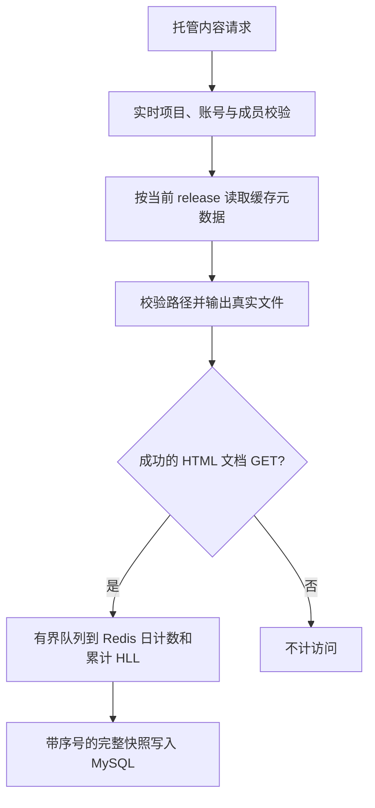

# Redis 读取缓存与网页访问统计

本功能为 Home Server 增加可关闭的实体缓存，以及网页托管的每日 PV/UV 和累计 PV/UV。Redis 保存热数据和待持久化统计，MySQL 保存最近 90 个自然日的每日汇总及长期累计量；上传文件仍由原发布目录提供。

## 1. 功能与边界

| 能力 | 实现 | 保留的边界 |
|---|---|---|
| 通用 MGet | `utils/cache`：泛型、去重分批、逐 key 合并回源、JSON envelope、硬 TTL、独立空值、失败回源 | 不依赖内部平台或缓存框架；源错误不写成不存在 |
| 书目 / 库位 | 同一 ISBN / ID 的正值读取缓存，批量查询仍批量回源 | 保留 ISBN-10/13、大小写与重复记录语义；库存数量、分页结果不缓存 |
| 托管版本 | 按项目和 release ID 缓存 ready 版本的独立元数据 DTO | 项目控制信息、成员关系、所有者状态实时查询；不能缓存“允许访问” |
| 应用 Token | 缓存不可变 Token 快照，期限最多 120 秒且不超过 Token 到期 | 应用状态、密钥版本、revision、scope、账号和模块仍实时验证 |
| 请求内复用 | GET/HEAD 内复用同一账号与模块开关的来源读取 | 仅在单请求生命周期内；下一请求新读；写事务锁定复核保持 |
| 访问统计 | HTML 文档 GET 成功后异步计数，按 `Asia/Shanghai` 分日 | 统计不是计费账本，不记录逐次访问明细 |

Redis 相关开关默认关闭。请求内来源复用是一项独立的内存优化，不需要 Redis；`cache.enabled` 只控制跨请求 Redis 读取缓存。



## 2. 开启前准备

只有要开启访问统计时才需要统计表；仅使用普通缓存无需新增表。

| 准备项 | 要求 |
|---|---|
| Redis | 单机实例、可达、版本支持 pipeline、事务和 HyperLogLog；允许使用现有淘汰策略 |
| ACL | 允许该应用前缀的 String/Hash/Set/HLL、EXISTS、SCAN、MULTI/EXEC 等普通命令；不需要 PING、Lua/EVAL、CONFIG 或 FLUSHDB 权限 |
| 持久化 | 可按设备磁盘能力配置 AOF；MySQL 快照是恢复基线，代码不会修改 Redis 服务配置 |
| 数据库 | 在目标数据库手动执行 `domain/dal/migrations/20260914_web_project_stats.sql`，确认两张表及索引正确 |
| 访客 HMAC 密钥 | 至少 32 字节、最多 4096 字节的独立随机密钥，文件仅服务账号可读（例如 0600），禁止符号链接 |
| 部署方式 | 单个统计写者；使用 stop/start，不能同时运行两个使用同一数据空间的后端 |

统计以可用性优先：不读取或限制 Redis 淘汰策略，也不把 Redis 变成网页响应的硬依赖。工作 key 被逐出、类型异常或 Redis 重启回退到旧数据时，worker 从 MySQL 最近快照恢复并将受影响日期标记为 `degraded`。恢复窗口内允许少量漏计、重复计或 UV 偏差；Redis 完全不可用时事件可能丢失，但网页仍正常提供。

迁移是增量建表、可以重复执行 `CREATE TABLE IF NOT EXISTS`，但这不代表它会自动修复已有错误表结构。应用启动不执行 DDL；现有业务表和用户数据不由该迁移修改。

## 3. 启动配置

在受限的服务端 YAML 中加入配置，完整默认值见 `config/config_example.yaml`。以下内容不含真实凭据。

```yaml
redis:
  enabled: true
  address: '127.0.0.1:6379'
  db: 0
  username: ''
  password_file: ''
  key_prefix: 'hs:prod'
  dial_timeout_ms: 200
  command_timeout_ms: 20
  pool_size: 8
cache:
  enabled: true
  namespaces: [book, book_address, web_release, app_token]
analytics:
  enabled: true
  timezone: 'Asia/Shanghai'
  retention_days: 90
  hot_days: 3
  flush_interval_seconds: 60
  queue_size: 4096
  visitor_hmac_key_file: '/etc/home_server/analytics-visitor.key'
```

`127.0.0.1` 是后端进程所在主机，不是浏览器所在主机。密码和访客密钥文件不得放入公开网页、Git、日志或命令参数。Redis 密码文件可省略；使用时需要绝对路径、私有权限、普通文件和大小限制。

| 设置 | 含义 |
|---|---|
| `redis.enabled` | 创建连接客户端；不可达不把普通网站启动变为 Redis 强依赖 |
| `cache.enabled` | 开启所选 Redis 读取缓存；关闭时直接走原来源 |
| `cache.namespaces` | 缺省使用四个已知场景；显式 `[]` 开启零个场景，未知值和重复值被拒绝 |
| `analytics.enabled` | 开启独立统计 worker；不依赖 `cache.enabled`，但要求 `redis.enabled` |
| `command_timeout_ms` | Redis 客户端的基础 I/O 超时；开启统计时底层超时自动提升到 2 秒，缓存 MGET/SET/DEL 仍以每次 20 毫秒 context 为准 |
| `timezone` / `retention_days` | 当前产品契约固定为 `Asia/Shanghai` / 90；不要直接改变既有历史数据口径 |
| `flush_interval_seconds` | 正常最多每 60 秒保存一次，有较多事件时提前保存；界面读取已提交快照 |

这些设置是启动配置，不属于管理员动态配置中心的可编辑值。访客密钥在同一统计历史中必须稳定保存；更换密钥会使相同浏览器的摘要改变，不能将密钥轮换当成普通无损操作。它与登录/应用密钥无关。

## 4. 缓存如何工作

普通 key 位于 `<key_prefix>:cache:v1:<namespace>:...`。调用方先去重，每批最多 100 个 key，只有缺失 key 进入 loader；重叠请求共享同一 key 的在途来源读取，新 key 仍批量加载。等待者可以独立取消；共享 loader 最长 3 秒、最多同时 16 个，来源函数必须遵守 context。

| 场景 | TTL / 失效 |
|---|---|
| 书目 | 6 小时，普通 TTL 有 ±10% 抖动；写入/删除后清理两个 ISBN 别名及 ISBN10-only 模式 |
| 库位 | 10 分钟；成功创建/删除后清理；事务尚未提交时不发布新值 |
| 发布版本 | 最多 5 分钟；清理状态提交和存储 key 成功迁移后失效，读取仍校验归属 |
| 应用 Token | 最多 120 秒，且不晚于真实到期；当前应用和用户的撤销信息不缓存 |

本轮业务接入默认不写负缓存，防止将需要继续 RPC 查询的缺失书目、未提交数据或鉴权失败混同于“确认不存在”。util 支持独立短期负缓存，后续调用方只有在 loader 成功覆盖所有请求 key 时才能启用。

缓存不能改变源查询的大小写语义。书目使用原始输入 key；仅规范数字 ISBN（ISBN10 末位可为大写 X）进入缓存。请求或返回别名含小写 x、空格等非规范内容时，保守执行原查询，避免推断数据库排序规则。历史重复 ISBN 的单条查询也保持原来的 `Take` 行选择，不从缓存排序结果擅自挑一条。较大的 DTO（超过 64KiB）不写缓存。

JSON DTO 必须包含内部读取需要的字段。不能直接缓存 `WebProjectRelease` 或 `ApplicationAccessToken`：这些模型有 API 用途的 `json:"-"` 字段，枚举也可能只有输出转换。专用 DTO 在缓存边界显式转换，不改变原公共模型。

来源错误与不存在分开处理；缓存读写故障降级，缓存写失败不改变成功业务响应。每个批次的缓存读/写各限时 20ms，客户端启用 context 超时并只做一次受截止时间约束的重试。多个批次的总预算按批次数增加，不能称为整个大批请求恒定 40ms。

提交后失效仍允许普通实体存在“旧读晚回填”导致的最多硬 TTL 陈旧；权限和事务不使用这些实体缓存。需要改变已发布文件的 `storage_key` 时，仍应先暂停该场景缓存并排空在途请求，再迁移、失效并重新开启。

## 5. PV 与 UV 口径

| 项目 | 定义 |
|---|---|
| PV | `/p/` 下 HTML/HTM 文档 GET 的 200 或条件请求 304；刷新、新文档和 HTML 子页面均计数 |
| 文档识别 | 有 `Sec-Fetch-Dest` 时仅 document/iframe；无该头时使用 HTML/HTM 后缀和 `Accept: text/html` |
| 不计数 | HEAD、CSS/JS/图片/字体、下载、Range 206、跳转、错误、prefetch/prerender、管理页和审计预览；过滤明确的常见机器人标识 |
| 每日 UV | 同项目、同自然日的浏览器访客近似去重 |
| 累计 UV | 独立 all-time HyperLogLog；每日 UV 相加不等于累计去重 UV |
| SPA | 没有新增 HTML 请求的 hash/history 内部路由变化不额外计数，不注入脚本 |

使用独立的 `__Host-cq_visit` Cookie：128-bit 随机值，Secure、HttpOnly、SameSite=Lax、Path=/、不设置 Domain，建议寿命 365 天。计数使用项目维度 HMAC 摘要，不使用登录 Token、应用凭据、原始 IP 或账号身份。

清 Cookie、换浏览器、换设备、不同 hostname 会被视为不同访客。内外网域名的 host-only Cookie 不共享；不为去重扩大登录 Cookie 的范围。机器人过滤也不能把 UV 变成精确人数。

Redis HLL 的标准误差约 0.81%，不是单个结果的误差上限；单个结构最多约 12KB。[Redis HLL 文档](https://redis.io/docs/latest/develop/data-types/probabilistic/hyperloglogs/)

统计从真实首次采集开始。启用前的历史访问不补造；首次并发导航可能创建不同访客 ID，断连也不能由服务端精确判断是否完成阅读。

## 6. 持久化、恢复和保留

统计使用 `<key_prefix>:analytics:v1:`。一个 worker 消费有界队列；使用普通命令与事务 pipeline 更新每日/累计 PV、两个 HLL、序号与脏标记，不执行 Lua/EVAL。HTTP 不等待 Redis 或 MySQL。

| 表 | 用途 / 索引 |
|---|---|
| `web_project_stat_total` | 每项目长期 PV、UV、HLL bytes、序号、开始时间、质量和格式/时区；主键 project_id |
| `web_project_stat_daily` | 每日 PV、UV、HLL bytes、快照序号和质量；主键 `(project_id, stat_date)`，清理索引 `(stat_date, project_id)` |

快照包含全部脏日期和累计数据，在同一个 SQL 事务中按单调 seq 覆盖绝对值。相同序号重试不重复累加，较旧快照不能回退数据。提交成功后再按已观察的序号清除脏标记；单 worker 下不会与自身访问写入交错，多写者竞争不属于当前保证。

HLL 二进制与数值一起保存，Redis 工作集丢失时可从 MySQL 最近快照继续近似去重。worker 每次刷盘前核对 SQL 序号；缺 key、类型错误或完整但较旧的 Redis 状态会触发恢复，并通过 SCAN 清理该项目遗留 HLL。普通命令、pipeline 和客户端重试不提供严格一次语义，因此故障边界可能少计或多计。最终返回错误、状态损坏与恢复会留下质量标记；若首次命令已执行而客户端重试成功，少量重复计数无法与正常访问区分，也不会自动产生标记。这个取舍避免脚本权限和严格淘汰策略成为可用性前提。

今天是 D 时，SQL 保留 `[D-89,D]` 的 90 个自然日；日桶清理按索引分批 500 行，累计数据不清零。Redis 正常保留近 3 日日桶与总桶，未持久化数据不靠 TTL 过期。关闭/重新发布页面保留 project_id 及累计量；软删除页面的统计不能通过管理接口绕过权限读取。

统计读取只返回 SQL 已提交值；正常延迟约一个刷新周期加实际写入时间。不额外从 Redis 与 SQL 拼接两个时刻的数据。返回列不含 HLL BLOB；展示未开始、缺口和不完整状态，不把未知日期伪装成健康零值。

## 7. 页面和接口

在网页编辑页的“访问统计”中查看累计/今日 PV 和 UV，以及最近 7/30/90 日趋势。日期轴上的未知或异常日期保留缺口；区间只合计 PV，不显示误导性的每日 UV 总和。

接口：`GET /api/web-share/:id/stats?days=30`，兼容 `/api/web-projects/:id/stats`。

- 沿用 `web-projects:read` 身份和 scope，并检查项目所有者；公开页面不意味着统计公开，管理员也不隐式成为所有者。
- `days` 只允许 7、30、90；已删除项目不可读。
- 关闭时返回明确 `enabled:false`；从未采集时开始/持久化时间为 null。
- 返回 `Cache-Control: no-store`，ID 使用字符串，计数由前端检查为安全整数。

## 8. 可观测性与故障限制

每分钟输出 namespace 维度的缓存 hit/miss/负缓存/解码失败/Redis 失败/来源失败/来源耗时，以及统计 accepted/dropped/unknown、队列、刷盘延迟、恢复次数和不可用原因。不把访客、Token 或完整 key 当指标标签。

| 故障 | 行为 |
|---|---|
| 普通缓存失败 | 回源并保留原错误契约，可能增加 SQL 负载 |
| Redis key 被淘汰或状态损坏 | 从最近 MySQL 快照重建工作集并标记缺口；恢复期间允许统计误差 |
| Redis 依赖不可用 | 当前事件可能丢失并报告；后续请求仍入有界队列并继续尝试，不阻止网页内容服务 |
| 队列满、超龄或事件结果不明 | 统计有缺口；已知项目/日期故障标记质量，不能承诺零丢失 |
| MySQL 暂时失败 | 保留失败前已进入 Redis 的未确认数据；为避免在未知 SQL 基线上继续覆盖，后续事件可能形成缺口，恢复后按完整快照重试 |
| 进程强杀 | 未送入 Redis 的内存事件可能丢失，无法保证事后识别每个受影响项目 |
| Redis 数据也丢失 | 只能恢复最后 SQL 快照；健康刷盘时通常存在约一分钟窗口，SQL 长期故障会扩大窗口 |
| 正常退出 | 停止采集、最多等待 5 秒排空和最终快照；超时记录未完成状态，不无限阻塞退出 |

AOF everysec 仍有持久化窗口，磁盘故障和内存队列也不由它解决。[Redis 持久化文档](https://redis.io/docs/latest/operate/oss_and_stack/management/persistence/)

这是趋势分析，不是计费或审计账本。单写者是明确前提；多实例需要额外持久化 fencing，而不是直接复用一个 Redis 锁。

## 9. 验证与回滚

新增测试覆盖：MGet 分批/并发/取消/错误/TTL/副本隔离，真实 Redis 回填和故障降级，书目别名与重复数据，release DTO/归属和事务后失效，应用 Token 期限，文档计数、Cookie 和权限，快照重复/乱序/提交结果不明、跨日、Redis 恢复、90 日清理与有界关闭。

测试使用独立 Redis 前缀与经过名称校验的专用数据库。`HOME_SERVER_CACHE_HTTP_TEST=1` 可让现有账号 HTTP 回归在真实缓存开启时运行；必须同时提供隔离 Redis 和合成账号 DSN。详细环境变量见相关测试 fixture 和 CI。不要把生产 DSN 或正式 Redis key 空间传入测试。

回滚可以关闭某个 namespace 或 `cache.enabled`。停统计先让进程完成有界最终快照，再关闭 `analytics.enabled`；保留统计表、HLL 和密钥。重新启用从现有数据恢复，不能执行 FLUSHDB、DROP TABLE 或将历史总量重置为零。新建的两张统计表不被旧业务版本读取，因此普通代码回滚不需要回滚数据库。
