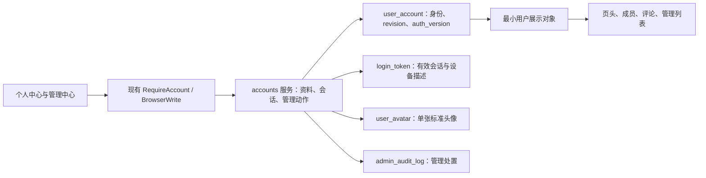
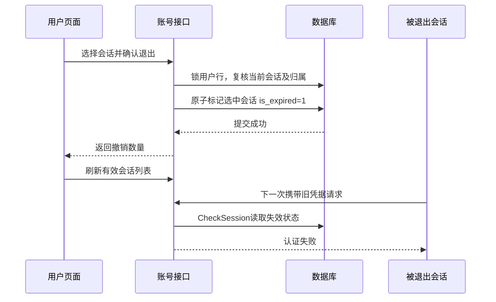

# Home Server 个人中心与账号治理

产品设计与技术方案 · 2026-09-18 · v1.1，个人中心及登录数量限制

基线：远端 `origin/master`，提交 [`8404303ab2c5cdde9a5cb6449db49d44c7f36730`](https://github.com/mcoder2014/home_server/commit/8404303ab2c5cdde9a5cb6449db49d44c7f36730)，提交时间 2026-09-16 13:37:51 +08:00。实现分支为 `feat/cq/account_center`；验证使用 Pi 的独立服务和合成数据库。线上启用需按增量升级流程执行；原型使用虚构数据。

## 01 核心判断与范围

**【核心判断】✅ 值得做。** 已有账号体系具备昵称、改密、账号封禁及会话撤销基础；补全头像、可辨认的会话列表和管理员处置闭环，可以直接解决识别用户、回收泄露登录态及治理不当资料的问题。

**【关键洞察】** 数据结构以 `user_account` 为用户、`login_token` 为一次登录凭据。设备是会话的辅助描述，不是新身份。最大的兼容风险是把“退出指定会话”误做成全账号撤销，以及封禁／解封时改变现有权限回收规则。

**【Linus式方案】** 复用当前账号字段和认证表；按会话 ID 撤销选中记录；头像采用有上限的单张存储；保留现有改密、封禁和全量撤销语义。新增独立接口，不重写认证框架。

| 方案 | 成本与取舍 | 结论 |
|---|---|---|
| 扩展现有账号／会话模型 | 沿用 Cookie、数据库校验、版本控制和管理员审计；增量实现 | **采用** |
| 另建完整设备中心并指纹去重 | 浏览器无法可靠识别物理设备；增加合并、误判和隐私成本 | 不采用 |
| 改造为 JWT／刷新令牌体系 | 需要迁移客户端、撤销与多端刷新协议，与本次目标无直接收益 | 不采用 |

首版范围包括个人资料、头像、密码、登录会话、全站身份展示、管理员会话数量及详情、封禁、资料重置，以及管理员可配置的同时登录上限，默认 5 个有效会话。保留现有联系方式、权限展示、邀请朋友和应用凭证入口。最近活动时间、登录历史、通知、二次验证和账号找回属于后续独立能力。数量异常提示人工核查，不自动封禁。

## 02 已确认现状与差距

| 能力 | master 已有实现 | 本方案新增或调整 |
|---|---|---|
| 个人中心 | `/account`、`/account/security`；昵称、邮箱、电话编辑；资料冲突保留草稿 | 增加头像和 `/account/sessions`；昵称文案统一 |
| 昵称展示 | `display_name` 已存在；页头与首页已优先显示昵称 | 补齐成员选择、网页所有者、邀请记录、评论及审计中的用户展示 |
| 头像 | 页头取名称首字，无上传能力 | 上传、裁剪预览、移除、异常回退、管理员重置 |
| 登录会话 | 摘要令牌、用户 ID、认证版本、用途、登录时间、期限、失效标记 | 记录登录 IP／UA／来源；只读列表、数量及按会话撤销 |
| 密码 | 验证当前密码；新密码策略；改密后提升 `auth_version`，停用应用凭据 | 保持语义，补清晰影响提示与客户端适配说明 |
| 管理员 | 用户列表／详情、封禁／解封、重置密码、全部退出、独立授权、审计 | 增加有效会话数、会话详情、昵称／头像重置 |
| 权限生效 | 每次认证读取会话与账号；GET 请求内有快照复用 | 继续以数据库为准，不加入跨请求会话缓存 |

代码依据：[`Account.vue`](https://github.com/mcoder2014/home_server/blob/8404303ab2c5cdde9a5cb6449db49d44c7f36730/front_vue/src/views/Account.vue)、[`MyHeader.vue:29`](https://github.com/mcoder2014/home_server/blob/8404303ab2c5cdde9a5cb6449db49d44c7f36730/front_vue/src/components/MyHeader.vue#L29)、[`account.go:20`](https://github.com/mcoder2014/home_server/blob/8404303ab2c5cdde9a5cb6449db49d44c7f36730/domain/model/account.go#L20)、[`CheckSession:233`](https://github.com/mcoder2014/home_server/blob/8404303ab2c5cdde9a5cb6449db49d44c7f36730/domain/service/accounts/service.go#L233)。

运行边界：新能力要求 `identity_source=database`。现有配置用户模式保留兼容，新增编辑／会话管理入口不对它开放。代码基线已核对；生产数据库结构、用户规模、代理可信网段与正式功能配置尚未核查，实施前需只读预检。发布这份文档无需改变这些配置。

## 03 页面结构与使用路径

入口保持页头头像菜单中的“个人中心”。桌面以资料卡和主内容区呈现，手机用横向标签及竖排会话卡，主要按钮高度至少 44px。保留既有路由直达与浏览器返回行为。

| 页面 | 核心内容 | 主要操作 |
|---|---|---|
| 个人资料 `/account` | 头像、昵称、用户名、用户 ID、联系方式、创建／导入时间、独立功能权限 | 编辑昵称、保存资料、更换／移除头像 |
| 账户安全 `/account/security` | 改密表单、影响范围、当前会话摘要、应用凭证入口 | 修改密码；进入登录管理；退出全部登录 |
| 登录管理 `/account/sessions` | 当前登录、其他有效登录、数量、更新时间、展开详情 | 刷新、单条／批量退出、退出其他全部登录 |
| 管理中心 `/admin/users` | 用户身份、状态、有效会话数、数量提示 | 查看会话、封禁／解封、重置昵称或头像 |

初始密码会话仍只允许个人信息读取、改密和退出；页面强制进入安全页，不能借新头像／会话接口扩大权限。应用 AK/SK 不获得个人中心或管理员能力。

状态必须可辨认：加载时展示骨架；查询失败保留旧数据并标注“刷新失败，数据截至 XX”；从未获得数据时显示“暂时无法获取”，不能显示成 0；空列表显示“暂无有效登录”；操作成功以服务端读回为准；网络结果不明先刷新，不盲目重试。

## 04 个人资料、头像与全站展示

### 昵称与联系方式

沿用 `display_name`，不另建 `nickname`。昵称去首尾空白后 0–64 个 Unicode 字符，空值表示使用登录用户名；非唯一，不能作为登录名、资源所有者标识或权限依据。前端当前不允许空昵称、后端允许空值，本次统一为允许清空，并显示用户名回退预览。登录用户名保持只读；联系方式仍不改变登录别名，也不提供密码找回。

提交仅包含用户实际修改的字段，沿用 `If-Match: revision`。管理员处置或另一标签页导致版本冲突时保留草稿、加载新资料，让用户选择重新编辑；不得自动覆盖新状态。头像变更单独保存，不顺带提交昵称草稿，成功后同步新 revision。

### 头像规则

| 项目 | 首版规则 |
|---|---|
| 输入 | JPEG／PNG，文件最多 2 MiB，宽高各不超过 4096、总像素不超过 1600 万；拒绝动画、SVG、外链头像 |
| 交互 | 选图后展示正方形裁剪与圆形预览，支持移动和缩放；取消不产生远端变更；明确点击“保存头像”才上传 |
| 服务端 | 独立检查大小、真实格式和像素上限；裁剪／缩放成 256×256 JPEG，透明区铺白，去除原图元信息；最终不超过 128 KiB |
| 保存 | 每用户只保留一张当前标准图；不保留原图与历史版本；上传失败保持原头像 |
| 移除／重置 | 删除当前头像内容，版本指针清零；昵称首个可显示字素作为占位，无可用字素时显示通用人形 |

客户端须处理照片方向并预览实际结果；服务端仍把所有上传视为不可信，不能凭浏览器预处理跳过检查。头像解码并发最多 2 个、编码有超时／像素／输出大小边界，饱和返回可重试错误，避免图片解码占满家庭设备内存。图片类型白名单与重新编码依据 [OWASP 文件上传建议](https://cheatsheetseries.owasp.org/cheatsheets/File_Upload_Cheat_Sheet.html)。

### 全站身份规则

统一显示 `display_name 非空 ? display_name : user_name`，头像取 `avatar_url`，缺失或加载失败使用占位；用户 ID 始终作为稳定身份。管理列表、成员选择、同名用户场景同时显示 `@用户名 / ID`，角色徽标由服务端角色决定，不能靠昵称伪装管理员。

| 展示位置 | 改动范围 |
|---|---|
| 页头、首页、个人中心、管理用户列表／详情 | 当前昵称＋头像；保存资料后立即更新当前 Vuex 状态 |
| 网页成员选择、管理网页所有者、邀请记录 | 返回最小用户展示对象，批量补齐资料；保留既有 `user_name` 等字段兼容旧客户端 |
| 托管容器及评论／回复 | 增加当前作者展示对象；人类作者展示当前昵称头像；应用作者保留应用名和“应用”标记，用户身份单独展示 |
| 管理审计 | 当前昵称便于识别，用户名／用户 ID／历史快照仍保留；不把历史快照改写为当前值 |

新增可复用的 `UserIdentity` 前端展示组件，负责真实复用场景中的回退与同名辨认，不抽通用资料管理框架。跨标签页仅广播“资料已更新”事件并重新拉取 `/api/auth/me`，不广播凭据；标签页重新可见时也刷新。其他读者下次读取即获取新资料，不承诺已经渲染的离线页面立即更新。

评论现存 `author_name_snapshot` / `actor_name_snapshot` 保留为历史证据。读接口按本页用户 ID 批量附加当前资料，不逐条查询；管理员重置后普通评论视图不再回退到旧违规快照。账号已删除／资料不可读时显示“已注销用户”与默认头像，历史名称仅在有权查看的记录中呈现。依据 [`webcomments/service.go`](https://github.com/mcoder2014/home_server/blob/8404303ab2c5cdde9a5cb6449db49d44c7f36730/domain/service/webcomments/service.go#L331)。

实施契约：普通评论响应保留同名 `author_name_snapshot` / `actor_name_snapshot` 字段，其人类作者值投影为当前显示名，数据库原始历史不改写；应用作者的应用名称保持。读取、写入及幂等响应均遵守此规则。注销身份保留不可修改的稳定用户名以兼容旧字段，昵称显示“已注销用户”，头像为空；配置用户模式按配置中的真实用户名补齐身份。

## 05 登录管理：辨认、选择与退出

页面标题为“登录管理”，计数文案为“有效登录会话”。一条记录对应一份登录凭据：同设备不同浏览器／无痕窗口、重复登录可以产生多条记录；复制同一凭据到另一设备仍是同一条记录。不能可靠统计物理设备，也不能把“未过期”写成“正在在线”。

### 网站同时登录上限

管理员在“站点设置 → 账号策略”配置 `account_policy.max_active_sessions`，默认 5，允许 1–100 个有效网站会话。普通网站登录与旧 RSA 登录共享上限；受限改密会话也占用名额。应用 Token、WebDAV Basic 与同一 Token 的 Cookie 兑换不产生名额。

达到上限时拒绝新登录，保留已有会话；网站登录返回 429，提示从已登录设备退出其他登录或联系管理员。旧 RSA 入口保留原 HTTP 200 响应封装，通过错误码表达同一限制，不返回新 Token。退出或自然过期后可再次登录。调高上限对下一次签发生效；调低不主动退出已有会话，在数量降至新上限以下前拒绝继续签发。登录管理显示有效数量与网站上限。

签发先锁同一用户行，再以当前锁定读读取最多 `max_active_sessions` 条有效会话，足额即拒绝，不生成凭据、不修改最近登录时间。不得使用旧事务快照判断名额；并发网站／旧入口登录不能超过上限。

| 字段 | 来源与展示规则 |
|---|---|
| 当前登录 | 由本次请求真正通过认证的会话 ID 比较，前端不传当前 ID 自证身份 |
| 客户端／系统／类型 | 对登录时 UA 做尽力解析，例如 Chrome、macOS、桌面；版本缺失就省略，无法识别显示“未知” |
| 登录 IP | 复用 `TrustedClientIP`；支持 IPv4／IPv6；标明“登录时 IP”，不声称当前位置或当前 IP |
| 登录时间 | 优先 `authenticated_at`；存量仅有合法 `create_time` 时标明“会话创建时间”；缺失显示未知 |
| 到期时间／剩余时间 | 由服务端 `server_time` 和有效到期时间计算；显示绝对时间及“剩余 2 天 3 小时”，不逐秒轮询 |
| 登录来源／用途 | 网站登录、旧版客户端、历史来源未知；普通会话或仅改密的受限会话 |
| UA 原文 | 展开详情后展示，纯文本且最多 1024 字节；只供本人和管理员查阅，不作为授权依据 |

UA 可能被伪造或浏览器缩减，不保证精确 OS 版本、物理型号或设备名称。首版不采集指纹、MAC 地址、硬件序列号和精准地理位置。依据 [MDN UA 缩减说明](https://developer.mozilla.org/en-US/docs/Web/HTTP/Guides/User-agent_reduction)。

当前会话卡单独固定展示；其他会话按 `create_time DESC, id DESC` 分页，每页 20、上限 100，游标包含这两个字段。不能把现有会话 ID 当成时间排序依据。日期统一标明 UTC+8，与现有界面一致；倒计时使用服务端时间偏移修正本机时钟，归零后刷新确认。

| 动作 | 产品行为 | 服务端影响 |
|---|---|---|
| 退出某一条／选中多条 | 二次确认，展示数量与设备描述；批量最多 100 条，当前会话不可勾选 | 只将指定本人会话 `is_expired=1`；不改 `auth_version`、密码或应用状态 |
| 退出其他全部登录 | 明示包括列表下一页；保留当前登录 | 在用户锁内撤销当时全部其他有效会话；提交后新建立的会话不属于此次操作 |
| 退出当前登录 | 当前卡独立按钮，成功后回登录页 | 复用现有 `/api/auth/logout` 并清 Cookie |
| 退出全部登录 | 放在安全页的高影响操作区，包含当前设备 | 复用原 `/api/auth/logout-all`，保留全会话失效及应用凭据停用行为 |

成功退出后，下次认证请求即拒绝该会话；已完成或已经通过认证的在途请求不能追溯撤回，长连接和已下载内容不会凭空消失。页面在收到 401 时清理会话信息并引导登录；保持匿名可访问页面的现有行为。后台不靠删除客户端 Cookie 实现撤销。产品依据 [OWASP 会话管理建议](https://cheatsheetseries.owasp.org/cheatsheets/Session_Management_Cheat_Sheet.html)。

## 06 密码与管理员治理

### 密码兼容规则

修改密码继续要求当前密码、新密码、重复输入。最低长度读 `/api/auth/me.password_policy.min_length`，不得硬编码成更弱策略；当前代码下限 15 个 Unicode 字符，上限 72 个 UTF-8 字节，允许空格和粘贴，拒绝空字符、两次不一致以及新旧相同。忘记密码仍联系管理员，不把未验证邮箱当作找回凭据。

确认文案明确写：“修改后包括当前设备在内的全部网站登录失效，应用凭据停用，WebDAV 客户端需要更新密码。”管理员重置密码生成初始密码的既有流程保持不变，不能将“重置头像／昵称”混入密码重置。

### 管理员操作闭环

列表新增“有效登录”列，显示总数；受限账号例如显示“3 个，仅可改密”。现有签发和改密流程不会让同一认证版本下的普通会话与改密会话同时有效，界面不得编造混合示例。首版 **达到 10 条**显示“数量偏多，建议核查”，10 是设计默认提示阈值，不是已验证风险阈值。提示不阻止登录，也不触发自动封禁。首版继续使用原用户名／状态过滤和用户 ID 分页，不增加“按会话数全站排序／过滤”，避免先分页后过滤产生遗漏。

点击数量进入用户详情的“登录会话”标签，使用相同有效性判断和分页规则，显示用户名／ID防止误处置。管理员可以封禁、执行已有的退出全部登录，或重置资料。首版不新增管理员逐条踢会话接口，批量治理复用现有全量撤销。

| 管理动作 | 必填与保护 | 结果 |
|---|---|---|
| 封禁用户 | 管理员当前密码、原因、目标 revision；禁止自封禁；保留至少一名可用管理员 | 沿用已有封禁事务和审计；本方案不自动判定封禁 |
| 解封用户 | 管理员密码、原因、revision | 只恢复账号状态；不恢复旧会话、应用、邀请码和原业务授权 |
| 重置昵称 | 同上；确认前展示重置后的用户名回退效果 | `display_name=''`；用户名、邮箱、电话、密码不变 |
| 重置头像 | 同上；展示重置前后预览 | 清空头像指针并删除当前图片；不撤销登录 |
| 同时重置昵称和头像 | 在同一确认框勾选两个字段，至少选一个 | 一个事务提交、一次审计；任何失败都不部分成功 |

重置后用户仍可重新设置头像或昵称；反复违规由管理员封禁处理，首版不添加资料禁改期限。管理员理由与前后摘要写入现有审计；图片仅记录版本、字节数等元数据，不把原图、密码或令牌放进审计。

现有封禁实际影响必须在确认框完整说明：网站会话失效、应用凭据停用、藏书权限与 WebDAV 权限回收、相关应用 scope 移除、未使用邀请撤销；所属托管页面的读取还受 owner 状态控制。封禁不等于删除数据。解封不自动恢复这些被回收的能力。依据 [`adminTransition:309`](https://github.com/mcoder2014/home_server/blob/8404303ab2c5cdde9a5cb6449db49d44c7f36730/domain/service/accounts/mutations.go#L309)。

## 07 认证影响矩阵与有效性口径

| 操作 | 当前会话 | 其他网站／旧客户端会话 | 应用凭据／应用访问令牌 | WebDAV Basic |
|---|---|---|---|---|
| 本人编辑或管理员重置资料 | 保持 | 保持 | 保持 | 保持 |
| 退出选中／其他会话 | 保持 | 仅选中范围失效 | 保持 | 保持 |
| 退出当前会话 | 失效 | 保持 | 保持 | 保持 |
| 现有退出全部 | 失效 | 全部失效 | 凭据停用，现有 Token 受应用状态校验拒绝 | 原密码仍可用 |
| 本人改密 | 失效 | 全部失效 | 同上 | 需改用新密码 |
| 管理员封禁 | 目标全部失效 | 目标全部失效 | 停用并按原规则回收 scope | 拒绝访问 |
| 解封 | 旧会话不复活 | 须重新登录 | 须核查后重新启用／授权 | 须另行恢复权限 |

应用 Token、WebDAV Basic 没有与网站登录表一一对应的设备记录，不混入设备数量。详情提供现有“应用凭证”和 WebDAV 权限入口说明范围。Basic 为逐请求认证，现有文档已明确它不依赖网站会话。依据 [`accounts-migration.md`](https://github.com/mcoder2014/home_server/blob/8404303ab2c5cdde9a5cb6449db49d44c7f36730/docs/accounts-migration.md)。

**有效登录 = 当前服务端仍接受的用户会话**，不能只写 `expire_time > now`。列表、数量、撤销选择集和鉴权使用相同条件：

```text
共同条件：用户存在且 status=active；token_digest 非空；is_expired=0；
          session.auth_version=user.auth_version；expire_time > 同一个 server_time。
普通登录：共同条件 AND purpose=user AND must_change_password=false。
改密登录：共同条件 AND purpose=password_change AND password_expires_at > server_time。
总数 = 普通登录数 + 改密登录数。
有效到期时间：普通登录为 expire_time；改密登录取 expire_time 与 password_expires_at 较早者。
```

封禁／删除用户、旧认证版本、已退出、未知 purpose、已过期初始密码均不计入。存量缺 UA／IP不影响有效性。列表、当前卡和数量在同一只读事务快照中查询，复用一次服务端时间；下一次刷新可能因真实并发登录变化，不宣称跨请求强一致。

## 08 技术结构与数据模型



### 头像存储选择

首版采用 **数据库独立头像表＋账号上的版本指针**。家庭／少量好友规模，每人最多 128 KiB，1,000 个用户的图像净数据上限约 125 MiB；头像替换、管理员重置、资料 revision 和审计可在一个数据库事务完成，不引入磁盘孤儿文件、清理队列和新的文件路径配置。图像字节不得进入常规账号查询或列表 DTO。

本地磁盘方案可以降低大规模数据库体积，但需额外处理数据库／文件一致性、旧 URL 授权及孤儿清理；当前已有网页文件目录按项目／版本组织，不适合直接借来放用户头像。若未来实测头像体积或读取负载超过数据库预算，再迁到独立媒体存储，保持 `avatar_url` 契约即可。

| 对象 | 新增字段 | 约束 |
|---|---|---|
| `user_account` | `avatar_version BIGINT NOT NULL DEFAULT 0` | 0 表示默认头像；有图时取本次更新后的用户 revision，避免删除后重复版本 |
| 新表 `user_avatar` | `user_id BIGINT PK`、`version BIGINT`、`content_type VARCHAR(32)`、`content_blob MEDIUMBLOB`、`byte_size INT UNSIGNED`、`update_time DATETIME(6)` | 每用户一行，内容只允许标准 JPEG；业务强制 ≤131072 字节；版本和账号指针同事务更新 |
| `login_token` | `login_ip VARCHAR(45)`、`user_agent VARCHAR(1024)`、`client_name VARCHAR(128)`、`os_name VARCHAR(128)`、`device_type VARCHAR(16)`、`login_source VARCHAR(24)` | 均允许为空／默认空；来源取固定枚举；UA限制按 UTF-8 安全截断 |
| 会话索引 | `(user_id,auth_version,is_expired,create_time,id)` 与 `(user_id,auth_version,is_expired,expire_time,create_time,id)` | 分页排序及有效期范围查询；固定当前认证版本，跳过自然过期及旧认证版本历史 |
| 清理索引 | `(expire_time,id)` | 自然到期后 30 天按批清空元信息；保留既有索引 |

不另存“剩余时间”“有效数量”或可写 `avatar_url`，避免派生状态漂移。头像 URL 根据用户 ID和头像版本生成。沿用已有会话 `id`、`authenticated_at`、`purpose`、`expire_time` 和 `is_expired`，不引入并行 session 表。新视图 DTO必须显式挑字段，禁止序列化令牌原文／摘要或密码哈希。

`last_seen_at` 和 `last_ip` 留在第二阶段：确需展示时再实现每会话最多 5 分钟一次的条件更新，并标注采样时间。首版没有实时心跳，不用最近登录时间冒充最近活动时间。

### 头像读取与缓存

新增 `GET /api/account/avatars/:user_id/:version`。它是站内用户展示资源，仅有效普通用户会话可读；头像是所有已登录用户可见的基础资料，不携带邮箱、电话或会话信息。匿名、受限改密会话和应用 Bearer 不可用；改密页显示占位头像。目标封禁／删除、无头像、版本不匹配统一返回 404，前端回退。

服务端每次先校验当前头像指针，再取匹配图像，返回 `image/jpeg`、`X-Content-Type-Options: nosniff`、`Cache-Control: private, no-store`。旧版本 URL 在重置提交后的新请求不能继续读到图片；已下载字节无法召回。账号响应增加只读 `avatar_url`，不向客户端暴露 BLOB，不使用 base64嵌入每份列表响应。

## 09 接口契约

下表为接口契约。沿用当前 `{code, message, data}` 响应封装、Cookie／兼容用户 Token 认证、HTTPS、精确 Origin、CSRF及错误码体系。所有 ID输出为十进制字符串；账号相关 JSON响应统一 `Cache-Control: no-store`。`GET /api/auth/me` 追加 `session_policy.max_active_sessions`；会话列表追加 `max_active_sessions`，均来自当前运行配置。

| 方法与路径 | 入参／返回 | 权限与并发 |
|---|---|---|
| `GET /api/auth/me`（沿用） | 原字段＋`avatar_url`、`avatar_version` | 保留受限改密会话读取能力 |
| `PATCH /api/account/profile`（沿用） | 修改字段；返回最新资料和 revision | 本人普通会话＋`If-Match` |
| `POST /api/account/avatar` | multipart `file`，仅一个标准裁剪结果；返回更新后的本人资料 | 普通用户＋BrowserWrite＋`If-Match` |
| `DELETE /api/account/avatar` | 无正文；返回更新后的资料 | 同上；无头像且版本匹配时成功且不重复递增 |
| `GET /api/account/avatars/:user_id/:version` | JPEG图像 | 按第08节的身份及版本检查 |
| `GET /api/account/sessions` | `cursor`、`limit`；`current_session`、其他 `items`、`total_count`、`restricted_count`、`server_time`、`has_more`、`next_cursor` | 本人普通会话；总数包含当前会话，items不重复当前 |
| `POST /api/account/sessions/revoke` | `session_ids: string[]`；返回 `revoked_count`、`already_inactive_count`、`server_time` | 本人；去重后 1–100 条；包含当前 ID为400；未知或他人 ID统一404且全部不执行 |
| `POST /api/account/sessions/revoke-others` | 无正文；返回本次撤销数量及 `server_time` | 本人；由后端取得当前会话，不能传 `keep_session_id` |
| `POST /api/auth/logout`、`logout-all`、`change-password`（沿用） | 原契约 | 不改变既有客户端语义 |
| `GET /api/admin/users`（沿用） | 每行追加 `active_session_count`、`restricted_session_count`；页面级 `server_time`、`session_warning_threshold=10` | 管理员；在当前页用户集合上批量统计 |
| `GET /api/admin/users/:id/sessions` | 游标列表、有效总数、受限数、`server_time`；items包含该用户全部会话 | 管理员；不泄露 Token／摘要；不存在账号404 |
| `POST /api/admin/users/:id/reset-profile` | `reset_display_name`、`reset_avatar`、`reason`、`current_password`；返回新用户资料 | 两项至少一项true；`If-Match`；管理员密码预算与事务内复核 |
| 管理员 `ban`／`unban`／`logout-all`（沿用） | 原请求、revision、理由和密码 | 继续走 `AdminChange` 与审计 |

会话 DTO示例只展示业务数据；这不是可以用于认证的凭据：

```json
{
  "id": "20301",
  "is_current": false,
  "purpose": "user",
  "login_source": "web",
  "client_name": "Chrome 140",
  "os_name": "macOS",
  "device_type": "desktop",
  "login_ip": "198.51.100.24",
  "user_agent": "Mozilla/5.0 (...) Chrome/140.0.0.0 Safari/537.36",
  "authenticated_at": "2026-09-17T09:20:00+08:00",
  "create_time": "2026-09-17T09:20:00+08:00",
  "expire_time": "2026-09-24T09:20:00+08:00",
  "effective_expire_time": "2026-09-24T09:20:00+08:00"
}
```

`avatar_url`、`current_session` 和资料版本由服务端决定。`session_ids`只能选择本人既有记录，不接受 `user_id`指定操作者。新接口不把认证版本、token_digest、密码哈希或联系人加入公开用户展示对象。

| 失败 | 前端行为 |
|---|---|
| 400参数不合法／文件格式错误 | 定位字段或文件错误；不丢失未提交资料 |
| 401会话失效 | 清理当前身份并转登录；不自动重放修改 |
| 403权限／CSRF／模式不支持 | 明确刷新或无权提示，不误写为密码错误 |
| 404目标不存在或不可见 | 刷新列表；不区分他人会话是否存在 |
| 409资料版本冲突 | 保留草稿，对照最新值后人工重新提交 |
| 413文件／请求过大，429频率／并发受限 | 明确限额／稍后重试；请求器须兼容代理返回的非JSON错误 |
| 5xx／连接中断 | 结果可能已提交，先读回状态；撤销可对同一已选 ID集合幂等重试，管理员动作及头像不自动重试 |

## 10 核心流程、并发与查询

### 登录时记录元信息

请求入口收集 `TrustedClientIP(request)` 和有界 `User-Agent`，解析后形成一个 `SessionMetadata` 参数，显式传给账号登录和 `issueSessionTx`，与会话同事务插入。UA 解析使用 [`github.com/mileusna/useragent`](https://github.com/mileusna/useragent) v1.3.5 的 `Parse`，提供浏览器、系统和类型；构建验证使用 Go 1.21.12。解析失败写“未知”且允许合法登录。

必须覆盖两个签发路径：`api/accounts/handlers.go.login → accounts.Login → issueSessionTx`，以及旧 `/passport/login → passport.GenToken → accounts.IssueVerifiedSession → issueSessionTx`。当前 `GenToken` 使用 `context.Background()`，会丢失请求上下文；将内部签名明确加入 ctx和 metadata并更新其两个生产调用点，外部 HTTP协议保持不变。配置用户模式按原流程运行，元信息允许为空。

`/api/auth/browser-login` 与两个网页托管别名只是把同一用户 Token转为 Cookie，**不创建第二条会话、不重置登录时间／期限、不把兑换时的设备覆盖为原登录设备**。复制 Token的场景保留其同一会话本质。依据 [`passport/token.go:21`](https://github.com/mcoder2014/home_server/blob/8404303ab2c5cdde9a5cb6449db49d44c7f36730/domain/service/passport/token.go#L21) 和 [`api/auth/route.go`](https://github.com/mcoder2014/home_server/blob/8404303ab2c5cdde9a5cb6449db49d44c7f36730/api/auth/route.go)。

### 撤销与重新登录的竞争



`RequireAccount`将已验证会话 ID放入服务端上下文，不能由客户端传值覆盖。新增撤销操作先锁账号行，再按 ID升序锁会话；事务内复核操作者绑定的当前会话仍有效，核对全部目标归属后统一更新。已退出／已过期的本人记录计入 `already_inactive_count`，不存在或他人 ID使整个批次返回404。只更新目标标记，不递增账号认证版本。

“退出其他全部”与签发会话都锁同一用户行，线性化时点定义为取得用户锁并校验后：已存在的其他有效会话全部退出，提交之后的新登录保留。故操作成功仍可能在刷新时看到新会话；不能因此重复清空新登录。既有单条退出不改为物理删除，复用其可重入失效标记。当前会话被选中则返回参数错误，前端引导独立“退出当前登录”。

### 资料更新与管理员重置

头像先在事务外完成限流、受限解码与标准化，再短事务锁账号、复核身份与 revision；图片行、`avatar_version`、账号 `revision`一起提交。管理员重置复用 `AdminChange`的全局管理锁、双方账号固定顺序锁、密码快照复核与 revision检查，新增 `reset-profile`动作分支。头像行在账号锁之后处理，避免反向锁序。

重置只改变选中的资料字段及 revision，不提升 `auth_version`，不改变密码与授权。为新动作生成专用前后摘要，现有 `accountSummary`目前不记录昵称／头像，不能照搬后声称已审计。审计写失败则回滚处置；新摘要只包括重置字段的文字值／图片版本与大小。

### 数量和分页查询

用户列表先按现有规则获取一页最多 100 个用户，再把同一快照中的用户 ID／认证版本组成 OR 条件，执行**一次**会话聚合；仍与账号连接核对版本、状态及第07节用途规则，再回填零值。单用户详情的账号与数量也共用只读事务快照。仅在查询成功且没有记录时填 0，数据库失败返回错误。

列表只读取展示字段，按时间与 ID复合游标推进，不使用深 OFFSET。索引选择必须在独立合成 MariaDB 10.11数据上验证，并核对生产版本：分别对单用户列表、当前会话、100个用户的聚合跑 `EXPLAIN`；模拟10、100、10,000条历史会话，观察扫描行数与排序。当前源码的数据库迁移目标为 MariaDB 10.11，但不能据此假设生产结构已一致。

单用户查询固定快照中的认证版本，按 `expire_time > server_time` 查询范围，不在时间字段上做函数计算。有效总数不超过 100 时，列表通过 `USE INDEX (idx_login_token_effective_range)` 选择有效期范围索引，仅对有效候选排序；100 是当前允许配置的最大同时登录数。更多有效会话的存量账号保留自然索引选择，利用分页索引的 LIMIT 提前结束，数量查询始终返回真实总数，不截断成网站上限。

有效会话相关读取始终直查数据库，允许同一请求内共享快照，不接入Redis跨请求缓存。已有Redis用于内容缓存与访问统计，不负责会话撤销传播。依据 [`read_snapshot.go`](https://github.com/mcoder2014/home_server/blob/8404303ab2c5cdde9a5cb6449db49d44c7f36730/domain/service/accounts/read_snapshot.go) 和 [`queries.go:75`](https://github.com/mcoder2014/home_server/blob/8404303ab2c5cdde9a5cb6449db49d44c7f36730/domain/service/accounts/queries.go#L75)。

## 11 权限、代理与数据生命周期

**身份与防越权。** 新账号接口继续使用 `RequireAccount`，不复用可接受应用 Bearer的通用接口守卫。普通用户只能列出和撤销自己会话；管理员通过专门读接口查看他人；管理员重置必须验证其当前密码及角色，不把隐藏按钮当授权。个人会话 API不接受 WebDAV Basic。敏感写操作沿用 HTTPS＋Origin＋CSRF，不能取消上传场景的CSRF。

**代理与请求边界。** 现有 `/api/account/`在 [`api_auth_locations.conf:53`](https://github.com/mcoder2014/home_server/blob/8404303ab2c5cdde9a5cb6449db49d44c7f36730/config/nginx/api_auth_locations.conf#L53) 只允许16 KiB。仅为精确路径 `/api/account/avatar`增加独立 location，代理限额3 MiB，后端整个multipart请求限额 `2 MiB + 64 KiB`、文件仍限2 MiB；其他账号接口继续16 KiB。保持proxy_cache关闭及可信IP／HTTPS头配置。所有内外入口均需检查，不能只改后端上限。

**IP可信度。** 复用 [`TrustedClientIP:29`](https://github.com/mcoder2014/home_server/blob/8404303ab2c5cdde9a5cb6449db49d44c7f36730/api/middleware/account.go#L29)，只信任配置网段的代理转发链，不直接读取客户端传入的 X-Forwarded-For。代理配置错误时宁可展示代理地址／未知，不推测用户公网地址。

**资料和隐私。** 昵称、UA、管理员理由都以纯文本输出；头像拒绝任意URL，避免SSRF和外链跟踪。IP／UA仅本人和管理员读取，不进入首页、评论、公开身份对象或访问统计。普通业务日志仅记录动作、操作者ID、目标会话ID、数量、结果和请求追踪ID，不记录原始令牌、密码、完整Cookie及原始UA。

首版保存会话元信息至该会话自然到期后30天，随后清空新增IP／UA／解析描述字段；不为本次功能删除旧认证表记录或管理审计。增加受限的幂等 `accounts-maintain`维护命令及systemd每日timer，按 `(expire_time,id)` 分批最多500行擦除，每批提交；补清理索引前先EXPLAIN。原会话撤销行为不依赖timer。维护任务连续失败超过48小时告警。已删除用户的当前头像在删除用户事务中一并清除；封禁保留原图但读取路由拒绝，重置则实际删除。

**同源托管边界。** 仓库现有说明明确接受上传HTML与主站同源的风险。现有CSRF不能防御同源恶意脚本；这份方案不把它描述成已经隔离。头像只允许重新编码的图片，避免新增可执行上传类型。站点内容隔离、Passkey或独立二次确认令牌属于另一项安全演进，不通过本次头像功能顺带改造。

## 12 迁移、发布与回滚设计

迁移采用新文件，例如 `domain/dal/migrations/20260917_account_center.sql`，只增加字段／索引及头像表，**不得修改已发布的20260913迁移内容**。当前账号导入工具有严格结构验证，新字段需要检查其结构校验是否接受扩展：为新安装补齐新迁移阶段，不让旧导入工具误判，也不重新导入账号。

| 阶段 | 执行动作 | 放行条件 |
|---|---|---|
| 预检 | 核对生产数据库账号模式、MariaDB版本、表结构、用户及会话规模、所有入口代理；备份并做独立恢复演练 | 明确当前结构与可回滚版本；测试环境只使用合成数据 |
| 增量DDL | 加可空／默认空元信息、默认0头像指针及独立表；验证结构和索引 | 旧代码可忽略新增结构；按MariaDB DDL隐式提交处理阶段恢复 |
| 后端 | 部署兼容新增契约的版本，接通两个登录路径和旧Token兑换路径；保留现有路由 | 新旧会话均可正常认证；数量口径与鉴权一致 |
| 代理与前端 | 配置精确头像入口，部署新增标签／展示组件／管理员能力 | 受限账号不出现可用的越权入口；图片上传经过所有真实入口 |
| 验收 | 用专用账号与会话逐项测试，读回审计和状态 | 第14节核心用例通过后再开放功能 |

存量资料不强制重置：保留 `display_name`；`avatar_version=0`回退默认图；旧会话未知元信息显示“历史登录，设备信息未记录”，不根据当前访问UA补写成原登录设备，也不为了补齐数据强制所有人下线。期限不变，不引入滑动续期。

回滚优先撤回新前端，再退到兼容数据库账号模式的后端，保留新增字段／表。按会话退出使用旧代码已识别的 `is_expired`，回退不会使它复活；改密和封禁后的 `auth_version`也不能回退。恢复旧数据库备份可能复活凭据，不能作为常规代码回滚。旧版本前端可能继续展示评论历史名称快照，因此若已处置违规昵称，回滚需要保持新身份展示投影或关闭受影响展示，不能声称治理效果天然兼容旧界面。

旧 `account_policy` JSON 缺少新增上限时，先验证原始 SHA256，再在读取副本补默认 5；不写回 JSON、revision 或历史。新发布要求完整且合法的字段。V1 导入文档和摘要继续只包含原账号策略四个字段，避免新增默认值后误判旧导入源变化。回滚到不识别新增字段的后端前，须准备与旧注册表匹配的有效策略文档，不能直接把新 JSON 交给旧版本启动。

数据库 DDL 有锁表风险。演练与构建仅在隔离环境执行，正式数据库规模及维护窗口须上线预检。

## 13 实施拆分与改动落点

| 批次 | 修改位置 | 可独立验收的结果 |
|---|---|---|
| A：会话识别与读取 | `domain/model/account.go`、`domain/dal/account.go`、新增迁移；`accounts/service.go`、`passport/token.go`、两个登录handler；新增 `accounts/sessions.go` | 新登录有元信息；历史会话可读；计数／受限会话口径一致 |
| B：会话退出与管理页 | `api/middleware/account.go`、`api/accounts/routes.go`及小型会话handler；`accounts/queries.go`；`Account.vue`、`AdminUsers.vue`、router和accounts API | 单条／批量退出、保留当前退出其他、管理员数量和详情可用 |
| C：头像与全站展示 | 新 `accounts/avatars.go`及图片handler；显式DTO投影、用户展示组件；页头、首页、网页成员／所有者、邀请、评论容器、审计视图 | 更换／移除头像；昵称和头像在列出的真实使用点一致 |
| D：资料治理与交付 | `accounts/mutations.go`的 `reset-profile`分支与审计摘要；`AdminConfirm`、`AdminUsers`；精确Nginx入口、维护命令／timer及运维文档 | 管理员重置原子化；限额、清理与回滚完成演练 |

这些是同一首版的开发批次，不把用户要求拆成未交付的可选项。遵循现有Gin／GORM、Vue3／Vuex／Element Plus模式，不迁移状态管理、不改项目目录结构、不改公开错误码、不改Cookie名称。只有存在实际多个调用点的身份显示规则才做小范围复用。

后续可独立评估：最近活动采样、登录历史与异常通知、Passkey／MFA、经验证的找回渠道、可配置会话提醒阈值。没有真实数据支持前，不实现风险评分或设备指纹合并。

## 14 验收标准与测试重点

以下是验收用例，实际验证结果单独记录；测试以用户可见行为、授权结果和副作用为准。

| 组 | 必测场景 | 通过标准 |
|---|---|---|
| 资料 | 中文／Emoji／64字符／空昵称、修改联系方式、旧revision提交、头像保存与昵称草稿并存 | 字符规则一致；用户名回退；不改登录别名；冲突不丢草稿、不覆盖新资料 |
| 头像 | 正常JPEG／PNG、透明图片、超大小／像素、伪造MIME、SVG／动画、解码失败、并发上传与管理员重置 | 服务端独立拒绝非法图；失败保留原图；一次仅有一张当前图；旧URL无法再次读取 |
| 全站展示 | 页头／成员／邀请／网页所有者／评论／审计、同名、空昵称、缺图、注销、应用作者 | 当前身份规则统一；旧字段仍可消费；历史快照保留但不泄露已重置的违规显示 |
| 登录列表 | 两浏览器、同浏览器多标签、重复登录、IPv6、代理伪造、UA缩减／未知、旧会话 | 准确定位当前会话；不按IP或UA错误去重；未知信息不伪造 |
| 有效性 | 刚过期、`is_expired=1`、旧auth_version、封禁／删除、受限会话、临时密码过期、未知purpose | 数量与可认证结果一致；受限会话单列；错误不展示成0 |
| 登录上限 | 默认第 6 次、12／32 并发、旧 RSA、旧事务快照、过期释放、调高／调低、旧配置与回滚 | 仅有效会话占名额；无超发；满额保留原会话；旧配置与导入摘要不改写 |
| 选择退出 | 1条、多条、全部其他、当前ID、重复ID、他人ID混入、已失效ID、跨页 | 只退出目标；越权整批拒绝；当前会话和应用凭据保持；其他全部覆盖未加载页 |
| 并发 | 登录与退出其他竞争、两次撤销、会话被撤销后发起资料写入、封禁与登录竞争 | 按已定义锁序和提交时点生效；不得在封禁后签发可用会话；新接口事务内复核当前会话 |
| 改密兼容 | 普通／初始密码改密、15字符与72字节边界、旧密码错误、相同密码、应用停用、Basic | 原有HTTP语义和失败预算不变；网站旧会话失效；Basic按新密码验证 |
| 管理员 | 普通用户调用、应用Bearer、自封禁、最后管理员、密码错误、revision冲突、审计失败 | 服务端阻断；事务失败无部分重置；封禁／解封副作用与矩阵一致 |
| 查询性能 | 每页100用户、10,000历史会话、头像列表不读BLOB、元信息清理 | 无N+1、无深OFFSET；EXPLAIN和压测记录扫描行数／延迟；查询出错不放行 |
| 浏览器与入口 | 桌面／390px手机／320px窄屏、键盘与焦点、内外代理、413非JSON、断网及401 | 主要操作可完成；无页面级横向溢出；确认框说明准确；不泄露凭据 |
| 回滚 | 新增字段存在时运行旧兼容版、已撤销会话、已重置头像、元信息空值 | 无需DROP结构；凭据不复活；界面降级符合第12节限制 |

验证执行环境：Go 构建／测试在获准 Pi 或隔离 CI 运行，不在本地直接 `go test`；仓库 CI 与测试夹具使用合成账号和独立数据库。前端使用 `npm run test:frontend` 和 `npm run build`，实际浏览器连接 Pi 独立后端及 HTTPS 代理。

## 15 关键决策与实施前核查

| 已选定的设计决策 | 原因 |
|---|---|
| 以会话计数，不以物理设备计数 | 可从现有服务端数据准确判断；不误导风险判断 |
| 默认 5 个有效登录，管理员可调整；满额拒绝新登录 | 限制凭据数量，保留已有登录；并发签发在用户锁内校验 |
| 首版头像入独立DB表，最多128 KiB／用户 | 小规模场景下原子重置与运维成本更低；正常账号查询不读图像 |
| 数量达到10仅提示；人工封禁 | 缺乏真实基线，不能以数量代替风险证据 |
| 指定／其他会话退出不影响应用；原全量退出保留行为 | 满足细粒度控制，同时避免破坏现有契约 |
| 当前昵称头像用于展示，历史快照用于有权审计 | 重置能影响当前展示，历史证据不会被篡改 |

实施前待核查项限定为环境证据：生产是否已迁入数据库账号模式；现有索引与数据库版本；所有代理入口的上传上限与可信网段；用户／会话规模及家庭设备资源；UA与图片处理依赖的Go版本兼容性。没有这些证据不能承诺具体性能指标或无维护窗口DDL。

基线源码证据固定到提交；新增接口、字段和策略以实现分支为准，不能当作现网配置。交互原型仅演示规则，不发送账号、密码、头像或会话管理请求。
