# 文件分享与密码阅读：需求及技术方案

日期：2026-09-19。代码基线：master `1db4129`。状态：功能已实现。设计经过 GPT-6 审查，独立代码审查使用 gpt-5.6-sol max；验证结果见 verification.md。

## 目标与范围

面向家庭服务器的文件所有者和收件人：上传一次文件，建立多条独立分享；收件人通过不暴露存储结构的链接访问。网页托管、说明书增加密码阅读；统一全站视觉层级、表单、卡片、空状态与移动端布局。保留既有账号、应用凭证、网页评论、藏书及 WebDAV 行为。

| 能力 | 确定行为 |
|---|---|
| 匿名分享 | 无密码直接下载，或输入6位大小写敏感 ASCII 字母/数字分享码；支持指定与安全随机生成 |
| 登录分享 | 所有有效登录用户或指定成员；可叠加独立分享密码（8–72 UTF-8字节），不使用账号密码 |
| 有效期 | 不限、1天、7天、30天、自定义到期时间；“1个月”在界面明确为30天 |
| 次数 | 不限、1次、自定义N次；时间与次数可同时限制，任一达到即失效 |
| 文件和分享 | 文件属于上传者；每个文件可建立多条分享，各有独立链接、策略、计数和撤销状态 |
| 删除 | 撤销分享不删除文件；删除文件让其全部分享失效；过期记录保留供查看次数 |
| 密码阅读 | 网页和说明书在原可见范围上叠加密码；所有者管理可绕过，其他访问者须同时满足身份与密码 |
| 页面 | 管理页支持上传、文件列表、分享记录和复制链接；收件页显示解锁、登录、下载与失效状态 |

下载次数定义为“服务端通过全部校验，成功占用次数后开始发送文件”。中断传输不返还次数；页面打开、错误密码、HEAD、被拒绝的Range请求不计数。单次分享的下载按钮不会自动触发；不提供绕过计数的原文件预览或断点续传。没有密码的模式指无需额外验证即可点击下载。

## 真实现状与方案选择

`api/fileshare` 只有未注册的占位路由。网页资源统一经过 `api/webprojects/content.go`，说明书详情和原件、缩略图分别经过 `api/manuals/handlers.go` 与 `content.go`。说明书列表会生成封面和文字摘录，必须与密码保护一起处理。前端为 Vue 3 + Element Plus，后端为 Gin + GORM + MariaDB。

采用独立文件与分享表，加小型密码能力。把文件直接塞进网页版本会混淆发布、解压和下载次数；重建全站统一资源平台会扩大变更范围，两者均不采用。

## 数据与权限

| 数据 | 关键字段与约束 |
|---|---|
| files | id、owner_user_id、原文件名、私有storage_key、size_bytes、sha256、删除状态、创建时间；owner/id列表索引 |
| file_shares | id、file_id、owner_user_id、唯一高熵token、access_mode、secret_mode、bcrypt hash、expires_at、max_downloads、download_count、revoked_at；file/id索引 |
| file_share_members | share_id、user_id复合主键；指定成员必须有效 |
| resource_passwords | resource_type/resource_id复合主键、password_hash、version、update_time；清除密码保留记录并增加version |

分享token使用 crypto/rand，至少24个随机字节的 URL-safe 编码。公开响应不返回路径、storage_key、密码hash；密码/分享码只在首次创建响应显示，列表不可反查明文。文件下载用服务端文件句柄直接输出附件，无静态alias、绝对路径或对象存储重定向。

密码授权使用短期 Secure/HttpOnly/SameSite Cookie，绑定资源、密码版本和到期时间；最长1小时，服务重启失效可接受。每个内容请求仍重新检查所有者状态、原ACL、资源状态与密码版本。口令输入限速必须在bcrypt前执行，并限制全局并发与限速表容量。浏览器写操作沿用现有Origin/CSRF机制；密码不进入URL或日志，分享token路径须脱敏。Nginx仅对包含token的 `/api/file-shares/` 与 `/s/` 关闭访问日志和错误日志，其他路径保留错误诊断。密码错误/缺少授权返回403，避免既有前端401处理导致登出。登录回跳允许严格匹配的 `/s/:token` 与 `/files`；分享回跳通过 URL fragment 传递，避免令牌出现在登录页HTTP请求中。

## 接口契约

| 接口 | 语义 |
|---|---|
| GET/POST /api/files | 本人文件游标列表 / multipart上传 |
| GET/DELETE /api/files/:id | 本人文件详情 / 删除并让分享失效 |
| GET/POST /api/files/:id/shares | 分享记录 / 创建分享 |
| DELETE /api/files/:id/shares/:share_id | 撤销单条分享 |
| GET /api/file-shares/:token | 分享状态；未解锁返回通用锁状态，不含文件信息；次数为固定0、时间为空 |
| POST /api/file-shares/:token/unlock | 校验口令并发短期Cookie |
| POST /api/file-shares/:token/download | 校验、原子计数、流式附件响应 |
| GET/PUT /api/web-share/:id/password | 所有者查询或设置/清除网页密码；`/api/web-projects` 为完整兼容别名 |
| POST /api/web-share/:id/unlock | 满足原可见性后解锁网页；`/api/web-projects` 为完整兼容别名 |
| GET/PUT /api/manuals/:id/password | 所有者查询或设置/清除说明书密码 |
| POST /api/manuals/:id/unlock | 满足原可见性后解锁说明书 |

分享创建字段：access_mode(public/authenticated/members)、member_user_ids、secret_mode(none/code/password)、secret、expires_at（可空）、max_downloads（0不限）。随机分享码可由客户端安全生成并提交或由服务端生成后仅返回一次。资源密码写入使用 `{password,version}`，空字符串表示清除；查询与写入只返回 `{password_protected,version}`。密码缺失或错误固定返回 HTTP 403/code 3，旧版本写入返回 HTTP 409/code 5，限速返回 HTTP 429/code 8。网页 HTML GET 可直接返回不依赖前端构建的同源解锁页，HEAD 和子资源仍返回 403；解锁密码只进入 JSON 请求体。

## 数据流

## 并发、存储与兼容

下载先验证权限并安全打开常规文件，再锁定资源/分享，重新检查撤销、到期、次数与身份快照，原子增加计数，事务提交成功后发送。计数更新必须通过行锁或条件UPDATE确保N次最多开始N次传输。撤销后已开始传输不强行中断。

文件存储根独立于WebDAV、网页和说明书目录；拒绝路径穿越、符号链接和非普通文件。默认文件上限50MiB，设置每用户总量、文件数和并发上传限制；临时文件失败清理，写入前后复核权限和容量。普通文件不解压、不执行，统一附件下载。新增配置默认关闭，增量DDL显式执行，不在服务启动时自动迁移。

网页门禁覆盖入口HTML、子资源、HEAD、Range、原始模式和评论读写；所有者管理/下载保持原权限。说明书门禁覆盖详情正文、文本、URL、原件、缩略图、HEAD/Range；受保护列表仅保留允许公开的标题/分类，隐藏内容摘要与封面。旧资源未设置密码时行为不变。

## 页面设计

延续现有墨绿主色，以浅色背景、清晰标题、统一间距、细边框和克制阴影组织信息。管理页将“文件”和“分享记录”分层展示；收件页以文件信息及一个主操作为中心。密码字段可显隐、随机生成/复制有明确反馈；时间和次数同时展示。覆盖320px窄屏、键盘焦点、上传进度、错误重试和失效状态；不引入新的UI框架。

## 验证与发布

| 阶段 | 验收内容 |
|---|---|
| 数据和服务 | 身份×密码×状态矩阵、N次并发上限、过期、撤销、删除、跨用户拒绝、错误密码限速、慢上传撤权、私有路径不可达 |
| 阅读保护 | 网页全部资源/评论与说明书详情/缩略图/列表无绕过；修改密码后旧Cookie失效 |
| 浏览器 | 上传→建多个分享→匿名/登录/成员/密码下载；网页与说明书设密/解锁；桌面及320px视觉检查 |
| 回归 | 既有Go CI包、前端行为和浏览器测试、Python技能测试、Nginx匹配与构建 |
| 发布 | 固定PR SHA；备份DB/配置；增量DDL与EXPLAIN；完整前后端release；Nginx -t；切current并健康检查 |
| 回滚 | 保留新增表与文件；已有密码记录时不能直接回旧后端，须先关闭内容访问或仅回前端，避免旧版本忽略密码 |

Go编译与测试在远端隔离环境执行。发布到Pi使用明确的PR提交，不自动合并master；保留worktree待PR合并后清理。文档HTML通过网页托管owner模式发布，并验证匿名访问被拒绝。

## 审查结论

GPT-6 已指出并纳入：文件与分享分离、POST下载避免预取耗次数、并发原子限额、打开文件后再扣次数、说明书列表侧漏、网页评论门禁、清除密码不能重用版本、未知/撤销/过期统一响应以及代理链路必须显式接入。

兼容边界：公开分享遇到已失效的浏览器登录 Cookie 按匿名处理，显式错误凭据仍被拒绝；登录或成员分享不会因此放行。网页所有者在资源停用或删除后仍可读评论历史，内容读取与非所有者访问保持原限制。

参考：[Go net/http](https://pkg.go.dev/net/http#ServeContent)、[Go bcrypt](https://pkg.go.dev/golang.org/x/crypto/bcrypt)。
