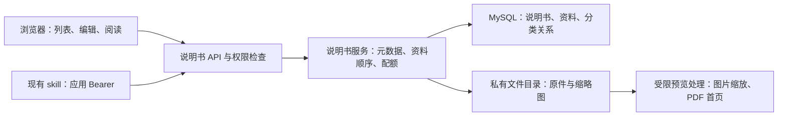

# 说明书管理：系统设计与技术方案

日期：2026-09-19。设计基线：master `176bce3`。

## 1. 目标与范围

将家庭设备的纸质照片、PDF、文字和官网链接组织成可检索的说明书。一份说明书包含多条有序资料，不要求用户先合成 PDF 或 HTML。

| 场景 | 目标行为 |
| --- | --- |
| 买到设备 | 输入名称、分类，批量选照片，可继续从其他相册追加；同时加入多个 PDF、文本和 URL |
| 找使用方法 | 按分类筛选、按名称包含关键词检索，浏览封面缩略图，进入详情按顺序查阅 |
| 分享 | 选择仅自己、登录用户、所有人可见，默认仅自己；分享链接不携带凭据 |
| 管理 | 所有者编辑名称、分类、资料顺序及可见范围，删除资料或整份说明书 |
| AI 操作 | 通过现有应用凭证机制与 skill 完成创建、上传、查询和编辑 |

采用个人单层多分类，每份说明书可属于多个分类，空数组表示未分类。分类名称去除首尾空白后精确去重，大小写不同视为不同分类；最多 20 个，每个最多 100 字符。分类关系在说明书内维护，筛选项从当前访问者可见的说明书中提取，不引入独立分类管理系统。名称允许重复，以 ID 唯一定位。匿名访问者可浏览公开说明书目录；登录用户看到自己及对其开放的说明书。

首期不含 OCR、正文全文搜索、自动抓取 URL 内容、设备资产/保修管理、协同编辑或版本发布系统。URL 只保存链接，外部网站下线后不能保证内容继续存在；需要长期留存的资料应上传文件。

## 2. 已核对的现状

| 真实来源 | 已确认事实及复用方式 |
| --- | --- |
| `api/webprojects/route.go`、`app/webprojects/projects.go` | 网页托管有草稿、版本发布、访问控制；说明书独立建模，复用身份及错误响应模式 |
| `api/middleware/identity.go`、`account.go` | 支持 Cookie、用户 token、应用 Bearer；Cookie 写请求带 CSRF/Origin 检查，显式错误凭据不降级匿名 |
| `domain/service/applications/service.go` | scope 是显式白名单；新增 `manuals:read`、`manuals:write`，write 包含 read |
| `config/runtime.go`、`registry.go` | 数据库配置快照要求所有 namespace 完整；首期说明书使用独立部署配置，避免添加 namespace 使已有快照失效 |
| `front_vue/src/router/index.js`、`permission.js` | Vue 3、Element Plus、现有登录守卫；说明书列表与阅读页面允许匿名，新建和编辑需要登录 |
| `skills/home-server-web-share/`、`script/home_server_api.py` | 已有 Python 标准库 HTTPS 客户端及凭据约束；扩展该 skill，保留原命令兼容性 |
| `.github/workflows/go.yml` | 有 Linux Go 构建、MariaDB/Redis 隔离集成测试、Node 和 Python 测试 |
| `deploy/pi/README.md` | 使用 release 目录和 current 软链部署，前后端统一切换；新增数据不随程序回滚删除 |

2026-09-19 只读现场检查：SSH 主机 `pi` 是 x86_64；前后端服务 active；当前 release 为 account-center PR #26 版本；存储盘可用约 126 GiB；已有 `/usr/bin/pdftoppm` 和 `/usr/bin/prlimit`；验证及构建使用临时独立的 Go 1.21.13 工具链，不改系统工具链。主机名不代表 ARM 架构。

## 3. 方案选择

| 方案 | 代价 | 判断 |
| --- | --- | --- |
| 独立说明书模块，共用身份与客户端 | 新增三张表、一组 API 和列表、编辑、阅读页面，存储及权限边界明确 | 采用 |
| 把资料自动拼成网页发布版本 | 图片/PDF 需要转换、重新发布，分类检索与单项编辑难以自然表达 | 不采用 |
| 接入完整文档管理系统 | 多一个部署、账号与备份体系，家庭场景收益不足 | 不采用 |

核心关系是“说明书 1:N 资料项”。一条资料只有一种类型，不拆成四套业务流程；文件类型差异集中在校验、缩略图生成与阅读展示。现有网页托管表、发布链路和存储路径保持原有语义。

## 4. 数据与存储

| 数据表 | 主要字段 | 约束 |
| --- | --- | --- |
| `manuals` | id、owner_user_id、name、description、access_mode、status、cover_item_id、revision、client_request_id、request_hash、create_time、update_time | access_mode 为 owner/authenticated/public；status 为 draft/active/deleted；唯一 `(owner_user_id, client_request_id)` |
| `manual_items` | id、manual_id、kind、title、text、url、storage_key、thumbnail_key、content_type、original_name、size_bytes、sha256、position、preview_status、client_request_id、request_hash、deleted_at、create_time | kind 为 image/pdf/text/url；唯一 `(manual_id, client_request_id)`；文件路径不作为外部 API 返回字段 |
| `manual_categories` | manual_id、category、create_time | 主键 `(manual_id, category)`；反查索引 `(category, manual_id)`；category 使用 utf8mb4_bin，与应用精确去重一致 |

ID 通过 JSON 字符串传输，避免 JavaScript 精度丢失。revision 是整数，元数据修改、排序和删除通过条件更新检测并发，冲突返回 409。创建与资料追加必须携带 client_request_id，使用 1—128 位 ASCII 字母、数字或 `._:-`（建议 UUID）；相同 ID 相同输入返回原结果，相同 ID 不同输入返回 409。

存储配置 `manuals.storage_root`，生产为 `/var/lib/home_server/manuals`。使用服务生成的 ID 组成 `<owner>/<manual>/<item>/original` 和 `thumbnail.jpg`，不拼接用户文件名；目录不位于 WebDAV、前端静态根或网页托管目录内。配置必须检查目录重叠和软链接。原件保留用于下载；缩略图重新编码并移除元数据。

文件先写到同文件系统临时目录，完成体积/格式检查及缩略图处理后原子移动到最终目录，再提交资料记录。失败清理本次已知临时文件；数据库提交结果不确定时按 request ID 与本次生成的 item ID 同时核对，不能误删可能已提交的原件；旧幂等条目不能把当前授权或资源状态错误转换为成功。崩溃遗留文件只允许离线核对后回收，不添加不可靠的周期删除器。

删除采用逻辑删除，立即禁止读取；保留文件以支持人工恢复与回滚。已删除文件继续占用配额，界面说明删除不立即释放物理空间。存储备份同时包含数据库与原件，缩略图可重新生成。

## 5. 上传和查阅

### 5.1 多选、多次追加与失败恢复

图片使用 `input[type=file][multiple]` 唤起系统相册，文件入口选择 PDF/文本文件。每次选择追加到当前队列，取消选择不清空已有队列。支持上传前移除、调整顺序，并显示每项进度与错误。一次保存可处理多个不同类型资料，客户端按队列逐项调用 API，不把全部原件拼成一个超大请求。

系统选择器决定是否能在单次操作里切换相册；网页保证多次选择的合并效果，不能承诺接管系统相册。重复文件提示由文件名、大小、修改时间辅助识别，不据此擅自丢弃文件。原生多选依据见 [MDN file input](https://developer.mozilla.org/en-US/docs/Web/HTML/Reference/Elements/input/file)。

新建先保存私有草稿，再逐项上传并记录成功项 ID；全部成功后按用户选择的范围激活。失败保留草稿和队列，仅重试失败项。刷新后可从草稿继续添加，但浏览器不能自动恢复用户尚未上传的本地文件，页面应提示重新选择。编辑现有说明书时，成功追加的资料即时可见，失败项明确标记，不能把部分成功提示为全部完成。

### 5.2 格式与缩略图

| 类型 | 输入及阅读 | 列表预览 |
| --- | --- | --- |
| 图片 | JPEG、PNG、GIF、WebP；原件下载与缩放查看 | 服务端生成最长边 480 px 的 JPEG；GIF 使用首帧 |
| PDF | 上传 PDF，浏览器内置查看器打开，另提供下载链接 | pi 已安装的 pdftoppm 渲染首页；失败显示 PDF 占位及预览不可用状态，原件保留 |
| 文本 | 多段 UTF-8 文本或 `.txt` 文件；文件上传解码后按相同 100000 字符上限保存为 kind=text，保留 original_name 和 UTF-8 size_bytes，不另存原件；纯文本显示、保留换行 | 文本摘要卡片 |
| URL | 多个 HTTP/HTTPS 地址与可选标题；外部新标签打开 | 域名与标题卡片；不抓取远程网页或 favicon |

默认第一条可用图片/PDF 缩略图为封面，所有者可选择其他资料作为封面。数据库 cover_item_id=NULL 表示自动选择，非 NULL 表示用户指定；自动结果在读取时计算，不写回该字段。PATCH 省略该字段保留原意图，传 null 恢复自动。删除指定封面后回到自动选择。没有图像型封面时使用文本或链接摘要。HEIC/HEIF 不冒充 JPEG；不能解码时单项拒绝并提示转换成 JPEG/PNG，不影响其他文件。图片按实际解码格式验证，前端 accept 和 MIME 不能替代服务端检查。

图片缩略图先应用 JPEG EXIF 方向，再缩放重新编码，避免手机竖拍图片侧倒。预览处理要限制图片像素数（40 MP）、输出尺寸、图片与 PDF 共用的预览处理并发（全站 1）及 PDF 超时（10 秒）；外部程序使用参数数组，不拼 shell 命令，并使用 pi 已有 prlimit 限制内存、CPU、输出文件和文件描述符。运行资源限制需在部署验证中确认。PDF 原件保存和预览成功分别报告。

默认限制：名称 120 字、每份 20 个分类且每个 100 字、描述 2000 字；每段文本 100000 字符、URL 2048 字节；单文件 50 MiB、每份 100 条资料和 500 MiB、每用户 1000 份说明书及 10 GiB，磁盘保留 2 GiB。后端拒绝超限，代理正文限制留 multipart 余量（52 MiB）。计数及字节配额必须在事务内串行检查，磁盘保护包含处理中上传的预留量。

### 5.3 列表与查询

列表卡片包含封面、名称、分类、资料数量、范围和更新时间；过滤项为“我可访问的 / 我的”、分类和名称关键词。分类与关键词可组合；省略 category 参数表示全部，显式 `category=` 表示仅未分类，其他值表示包含指定分类。分类筛选用 EXISTS，未分类用 NOT EXISTS，避免多分类关联造成列表重复。按 ID 倒序游标分页，默认 20、最大 100，不提供大 OFFSET。

名称模糊匹配定义为大小写不敏感的字面子串匹配，中文可用，`%` 和 `_` 作为普通字符。name 列显式使用 utf8mb4_unicode_ci；参数化 LIKE 同时转义 `%`、`_` 和选定转义符，并用真实 MariaDB 查询验证。名称不建误导性的 B-tree 模糊索引：SQL 先利用 owner/status/access 及分类关系索引限制候选，再执行名称过滤；这种残余过滤仍会扫描候选，不能宣称为索引命中。通过隔离数据库的 EXPLAIN 和代表性数据确认扫描量；不为家庭数量级引入搜索引擎。

分类建议及计数必须应用相同可见性条件，不能通过筛选项泄漏别人的私有分类。分类建议按 utf8mb4_bin 顺序分页，默认 200、最大 1000；cursor 是上一页返回的最后一个分类文本，需 URL 编码。has_more=false 时 next_cursor 为空；前端取全可见分类后展示，不静默截断。列表不逐条查 SQL、不返回大段文本及全部附件，按当前页 ID 批量补齐封面、资料数量和分类，禁止逐份查询。创建与修改分类和说明书元数据在同一事务提交；PATCH 省略 categories 保留现有分类，传空数组清空分类。

## 6. API 契约

沿用现有 ginfmt 响应封装及错误码；下面是封装内部的数据。路径以 `/api/manuals` 为前缀，浏览器与 skill 共用，数值 ID 均为字符串。

| 方法与路径 | 输入 / 输出 | 权限 |
| --- | --- | --- |
| GET `/api/manuals` | `q, category, mine, cursor, limit`；返回 `items, has_more, next_cursor` | 匿名仅 public active，登录按可见范围 |
| GET `/api/manuals/categories` | `mine, cursor, limit`；返回 `items: [分类名], has_more, next_cursor` | 仅包含有权看到的分类 |
| POST `/api/manuals` | `name, description, categories, access_mode, client_request_id`；返回草稿详情 | 登录/`manuals:write` |
| GET `/api/manuals/:id` | 返回说明书和有序 `items`，带 `can_edit` | 所有者可看草稿，其他人只读 active |
| PATCH `/api/manuals/:id` | `revision`，可选 name/description/categories/access_mode/status/cover_item_id/item_ids | 仅所有者；status 只允许 draft→active，active 至少有一项；item_ids 必须是完整有效项集合 |
| DELETE `/api/manuals/:id` | JSON `revision` | 仅所有者，逻辑删除 |
| POST `/api/manuals/:id/items` | `kind: text/url, title, text/url, client_request_id`；返回 `item, revision` | 仅所有者，幂等追加一项 |
| POST `/api/manuals/:id/files` | multipart `file, title, client_request_id` | 仅所有者，幂等追加一份文件；返回 `item, revision` |
| DELETE `/api/manuals/:id/items/:item_id` | JSON `revision` | 仅所有者；删除封面后重选默认封面，active 的最后一项不可删除 |
| GET/HEAD `/api/manuals/:id/items/:item_id/content` | 原件或 `?download=1`，支持 Range | 与说明书同一权限 |
| GET/HEAD `/api/manuals/:id/items/:item_id/thumbnail` | 缩略图 | 与说明书同一权限 |

详情字段：`id, name, description, categories, access_mode, status, revision, cover_item_id, cover_url, cover, item_count, can_edit, create_time, update_time, items`。资料字段：`id, kind, title, text, url, original_name, content_type, size_bytes, position, content_url, thumbnail_url, preview_status`。列表不包含 items 正文，使用有界 cover 对象：`id, kind, title, thumbnail_url, text_excerpt, url_host, preview_status`，其中 id 为当前实际封面资料 ID，text_excerpt 最多 160 字符。封面未显式指定时优先第一张可用图片/PDF 缩略图，否则首项；显式指定文本/URL 时显示该项摘要。

两种资料追加 API 都在说明书行锁内分配 position、将 revision 加一并返回 `{item, revision}`。相同请求的幂等重放不重复追加、不增加 revision，返回原资料及当前 revision。客户端每次成功后更新 revision，再用最新快照排序或激活；409 不自动覆盖其他终端的变更。

草稿 access_mode 可记录用户目标范围，但 status=draft 始终仅所有者可见。应用令牌对说明书读写需要各自 scope，并按应用所有者身份执行；应用并不扩大资源可见范围。所有者失效、账号禁用、强制改密、token 撤销与 Cookie CSRF 继续受原账号机制约束；匿名公开内容也不得绕过所有者账号状态规则。

所有写事务在取得账号/资源锁后复核账号状态、auth_version、精确用户会话是否已撤销、token 到期及应用授权快照，不能只依赖上传开始时的路由鉴权。数据库身份模式在任何非锁定数据库读取前，先锁定已知 owner 账号，再锁精确会话；这样 REPEATABLE READ 下后续配额查询能看到前一个事务的提交，不能用锁前会话查询建立旧快照。旧配置身份模式补充进程内用户锁，仅支持现有单实例部署。未删除的说明书和资料用于数量限制，未物理回收的文件全部用于字节配额。

## 7. 权限与故障边界

| 访问者 | owner | authenticated | public |
| --- | --- | --- | --- |
| 所有者 | 读写 | 读写 | 读写 |
| 其他有效登录用户 | 不可见 | 只读 | 只读 |
| 匿名 | 不可见 | 不可见 | 只读 |

管理员不自动获得私有说明书内容权限。列表、详情、content、thumbnail、HEAD、Range 和条件请求均先鉴权，再读文件；禁止静态 alias 暴露原件。无权限或已删除资源使用不可见响应，显式无效 Authorization 或用户 token 头按认证错误处理，不回退匿名。浏览器自动携带的失效 Cookie 可按匿名处理公开读请求，避免旧会话阻断公开内容；`mine=true` 和所有写请求仍必须有有效身份。数据库异常关闭访问，不用历史缓存决定权限。

内容响应使用 no-store、nosniff，下载名安全编码；文本只作为文本显示，URL 限制 HTTP/HTTPS 且禁止用户名密码，链接使用 noopener/noreferrer。PDF 在受限查看环境中展示，HTML/SVG/脚本和伪装文件不作为图片内联执行。公开变私有后下一次请求立刻检查新范围，已经下载的副本无法撤回。

说明书使用独立 `manuals` YAML 配置（enabled/storage_root/限制项），默认关闭。首期不改数据库配置 registry；`EnabledTx`、`ModuleEnabled` 对 manuals 使用静态开关分支，不能查询不存在的数据库 namespace。服务、身份能力映射、账号 `capabilities.manuals` 和公开引导信息 `modules.manuals` 读取相同静态配置，启用需要重启。这样原有配置快照和旧版本回滚不依赖新增 namespace。

## 8. Skill、验证与发布

在 `home-server-web-share` 内增加说明书使用说明与独立 `scripts/manuals.py`，复用同一私有配置和 HTTPS 客户端。提供 list/show/create/update/upload/add-text/add-url/delete/delete-item 命令，支持重复 --file 与多个文本/URL 条目。修改应用 scope 白名单和 UI 选项；现有凭证不会自动获得新 scope。

脚本默认私有、支持 dry-run，正文从 UTF-8 文件读取，幂等 ID 与 revision 规则同 API。写入后读取核对；失败不更换内外网入口、不机械重试，不从数据库或浏览器提取凭据。skill 文件内容与上传资料均视为数据。

验收覆盖四组：业务完整性（批量混合资料、排序/封面、多分类＋名称）；权限矩阵（列表及原件/缩略图/Range/HEAD一致）；异常一致性（重复提交、超限、断连、并发/数据库失败、删除与撤权）；兼容回归（账号、网页托管、藏书、WebDAV和旧skill）。真实 iOS/Android 相册体验需要设备验收，桌面自动化不能代替。

Go 不在本机运行，使用远端隔离环境或 GitHub Actions，数据库测试禁止生产 DSN。Node/Python 离线测试及前端构建在隔离工作区执行。部署前确认 SQL EXPLAIN、增量迁移、Nginx 配置、构建产物哈希和回滚包。

PR 保持打开等待用户合并；按已授权的安装要求部署通过验证的 PR 精确提交，不自动合并。pi 安装顺序：备份数据库/配置/旧 release 指针→增加三张表→安装私有目录与代理规则→准备匹配的前后端 release→验证配置→切 current 并重启→新功能及旧入口冒烟。失败切回旧 release/配置，保留新增表和数据。worktree 在用户合并后才释放。
