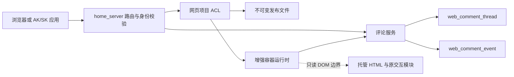
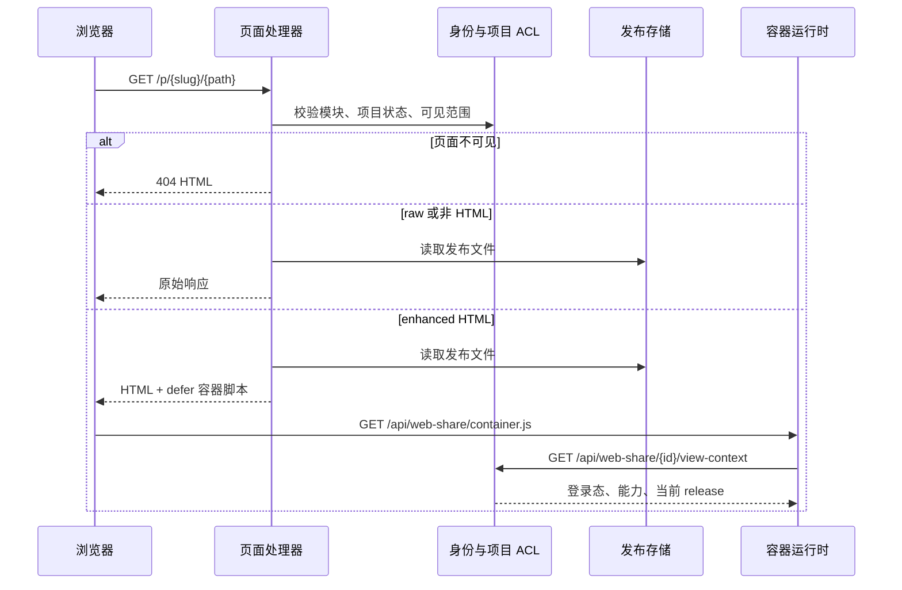
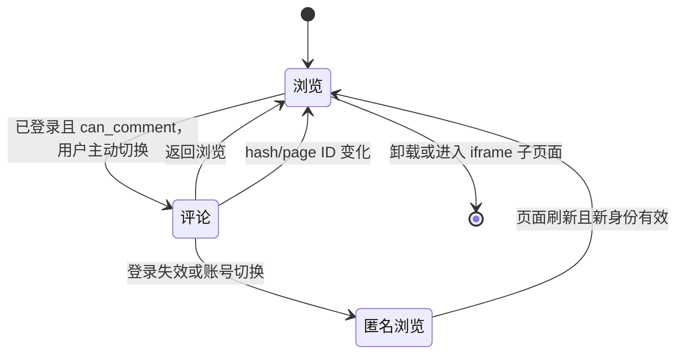
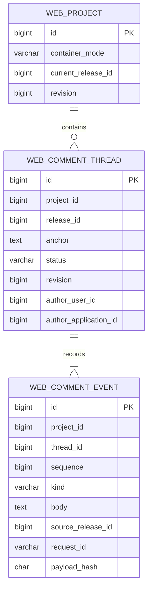
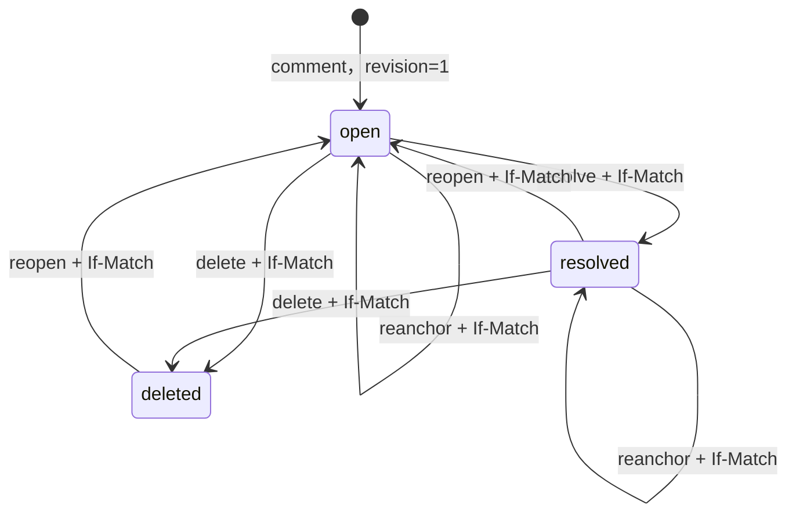

# 网页托管增强容器与评论能力技术方案

状态：实现版；基础容器已部署，新增 Skill 检查与删除仅完成静态检查和构建，未执行测试套件

更新时间：2026-09-16

关联需求：[网页托管增强容器与评论能力需求](web-container-comments-requirements.md)

## 1. 方案概览

增强容器由服务端在返回 HTML 时注入一段受控运行时。运行时通过同源 API 获取登录态与评论数据，平台侧继续负责账号、项目 ACL、应用 scope、持久化和并发控制。已发布文件保持不可变，下载和非 HTML 资源不经过变换。



### 1.1 设计取舍

| 决策 | 原因 |
| --- | --- |
| 响应时注入，不改写发布文件 | 保持版本摘要、下载结果和回滚语义不变 |
| 主题表 + 事件表 | 主题表提供当前查询，事件表保留消息和状态历史；无需第三张定位表 |
| 浏览与评论显式切换 | 默认不加载评论正文，也不让评论监听影响网页操作 |
| 稳定 ID + 原文上下文 | ID 解决重排/改名，原文校验避免把旧评论错贴到新内容 |
| 交互模块从侧栏选择 | 不在地图、图表、播放器上覆盖手势层 |
| 旧项目默认 `raw` | 数据库升级不改变现有页面行为 |

## 2. 组件与代码位置

| 组件 | 代码位置 | 职责 |
| --- | --- | --- |
| HTML 直出与注入 | `api/webprojects/content.go`、`container.go` | 页面 ACL、404、增强响应变换、运行时资源 |
| 评论 HTTP API | `api/webprojects/comments.go`、`route.go` | 参数边界、身份入口、CSRF、状态码与分页 |
| 评论领域服务 | `domain/service/webcomments` | ACL、状态机、幂等、并发、事件持久化 |
| 数据模型与迁移 | `domain/dal/migrations/20260916_web_comments.sql` | 容器模式、主题和事件表 |
| 浏览器运行时 | `api/webprojects/container/runtime.js` | 菜单、模式生命周期、DOM 定位、侧栏和页尾降级 |
| 项目编辑页 | `front_vue/src/views/WebProjectEditor.vue` | 选择增强/原始容器 |
| 应用权限 | `domain/service/applications`、`front_vue/src/views/Applications.vue` | `web-comments:read/write` scope |
| Agent 接口 | `skills/home-server-web-share` | 上传前兼容性检查、查询和处理评论、HTML 结构标准 |

## 3. 请求链路

### 3.1 页面访问



`serveEnhancedHTML` 最多读取 50 MiB HTML，并通过 HTML tokenizer 识别真实的 `</head>` 结束标签，再注入带项目 ID、发布 ID、入口文件的 `defer` 脚本；脚本字符串、注释中的 `</head>` 不会被误当成标签。没有 `head` 时退到真实 `</body>` 或文末。响应变换会清除原文件 ETag 和条件请求头，避免 raw/enhanced 表示混用。静态发布文件、ZIP 下载和非 HTML 资源不改变。

页面处理器把项目不存在、下线、审核不可用、用户无权访问和私有页面未登录统一转换为 HTML 404。公开页面允许匿名读取。

### 3.2 评论模式生命周期



运行时首先读取 `view-context`。匿名状态只挂载固定菜单；已登录状态也默认停留在浏览模式。进入评论模式后才分页读取主题、监听原生 Selection、扫描显式目标，并创建 Shadow DOM 侧栏和不接收指针事件的标记。

返回浏览、路由变化、身份变化和卸载会：

1. 中止容器请求并使迟到响应失效。
2. 移除 Selection、MutationObserver 和容器事件监听。
3. 清除标记、侧栏、待提交选择和当前账号内存草稿。
4. 保留原页面 DOM、业务监听和第三方组件实例。

## 4. 身份、权限与 CSRF

### 4.1 服务端授权顺序

写事务遵守固定锁顺序：配置 → 排序后的账号行 → 应用 → 项目 → 主题。事务提交前再次校验会话/Token 过期时间；应用写入还会再次检查应用状态、密钥版本、修订号和 `web-comments:write` scope，避免等待锁期间发生撤销后仍提交。

项目授权使用现有 `private/members/authenticated/public` 规则。项目必须已发布、启用且审核状态正常；只有项目所有者可在项目停用后读取历史。普通可见用户可以创建主题和回复，主题作者或项目所有者可以解决、重开和重新关联。

### 4.2 浏览器凭据

`view-context` 是唯一允许匿名调用的评论相关接口。公开项目的匿名响应只包含导航所需状态，`can_comment=false` 且 `csrf_token` 为空。

登录浏览器得到：

```json
{
  "project_name": "旅行方案",
  "owner_user_id": "101",
  "user_id": "102",
  "display_name": "测试用户",
  "can_comment": true,
  "csrf_token": "仅限-web-comments-的摘要",
  "release_id": "9001",
  "entry_file": "index.html",
  "container_mode": "enhanced"
}
```

浏览器写请求需要满足 HTTPS、受信任 Origin、登录 Cookie 和 `X-CSRF-Token`。评论接口接受现有账号级 Token 以保持兼容，但托管页只会得到 `ScopedCSRFToken(login_token, "web-comments")`。

### 4.3 AK/SK 应用

| scope | 能力 |
| --- | --- |
| `web-comments:read` | 列表、详情、事件历史和 request_id 核对 |
| `web-comments:write` | 创建、回复、解决、重开、重新关联；自动包含 read |

`web-projects:write` 不包含评论权限。应用访问 Token 的到期时间取 Token TTL 与应用到期时间中的较早值。

## 5. HTTP API

所有成功响应沿用项目统一 `{code: 0, data: ...}` 包装；错误使用现有错误映射。列表默认有限分页，`limit` 最大 100；写请求体最大 32 KiB。

| 方法 | 路径 | 说明 |
| --- | --- | --- |
| GET | `/api/web-share/{project_id}/view-context` | 页面身份、容器和评论能力；公开页允许匿名 |
| GET | `/api/web-share/{project_id}/comment-threads` | 主题列表；支持 `status=all/open/resolved/deleted`、`cursor`、`limit`、`request_id`；默认 all 不含 deleted |
| POST | `/api/web-share/{project_id}/comment-threads` | 创建主题 |
| GET | `/api/web-share/{project_id}/comment-threads/{thread_id}` | 主题当前状态 |
| GET | `/api/web-share/{project_id}/comment-threads/{thread_id}/events` | 事件流；支持 `cursor`/`after_seq`、`limit`、`request_id` |
| POST | `/api/web-share/{project_id}/comment-threads/{thread_id}/replies` | 回复，允许已解决主题 |
| POST | `/api/web-share/{project_id}/comment-threads/{thread_id}/resolve` | 解决；要求 `If-Match` |
| POST | `/api/web-share/{project_id}/comment-threads/{thread_id}/delete` | 软删除整个讨论与回复、追加审计；要求 `If-Match` |
| POST | `/api/web-share/{project_id}/comment-threads/{thread_id}/reopen` | 重开；要求 `If-Match` |
| POST | `/api/web-share/{project_id}/comment-threads/{thread_id}/reanchor` | 重新关联；要求 `If-Match` 和当前 release |

创建/重新关联输入示例：

```json
{
  "request_id": "comment-20260916-0001",
  "release_id": "9001",
  "page_key": "id:trip-guide",
  "page_path": "index.html",
  "anchor": {
    "kind": "text",
    "target_id": "day-one-summary",
    "exact": "上午参观博物馆",
    "prefix": "第一天：",
    "suffix": "，下午沿河步行。",
    "page_id": "trip-guide"
  },
  "body": "请核对开放时间"
}
```

约束：

- `request_id` 为 1～128 位 `[A-Za-z0-9_.:-]`。
- `body` 最多 4000 个 Unicode 字符；创建和回复不能为空。
- `target_id/page_id` 最多 96 字节并符合稳定 ID 正则。
- `exact/prefix/suffix/label` 分别最多 4096/128/128/256 个 Unicode 字符。
- 页面路径必须是清理后的项目相对路径，不能包含反斜杠、NUL、查询或片段。
- 创建与重新关联使用的 `release_id` 必须等于当前发布版本；版本变化返回冲突。
- 回复、解决、删除和重开可携带调用方实际查看的 `release_id`，该版本必须属于当前项目；版本文件已淘汰时可由本项目持久化的主题或事件证明归属，旧客户端省略时兼容记录当前版本。

## 6. 数据模型



### 6.1 主题表

`web_comment_thread` 保存列表所需当前状态：当前 release/page/anchor、状态、revision 和作者快照；同时保留 `original_*` 字段用于审计原始位置。状态为 `open/resolved/deleted`。`deleted` 隐藏整个讨论和回复，不物理清除数据；现有 VARCHAR 字段可容纳，无需增加 DDL。

### 6.2 事件表

`web_comment_event` 保存 `comment/reply/resolve/delete/reopen/reanchor`。事件不可更新；`sequence` 与写入后的主题 revision 相同，唯一键 `(thread_id, sequence)` 保证顺序。`source_release_id` 记录执行动作时调用方实际查看的页面版本，而不是事务执行时的最新版本。

幂等唯一键是 `(project_id, actor_user_id, actor_application_id, request_id)`。服务端保存标准输入的 SHA-256：

- 相同身份、request_id 和 payload 返回原主题。
- 相同 request_id 但 payload 不同返回 409。
- 一般历史查询隐藏 request_id；调用方按自己的 request_id 精确核对时才返回匹配结果。

### 6.3 并发状态机



回复也递增 revision，防止项目所有者在未看到新回复时用旧 revision 解决主题。状态变更和重新关联要求 `If-Match`；不一致返回冲突。

删除、已删除历史查询和恢复限于作者或项目所有者，仍须通过项目 ACL、有效身份与应用 scope。其他读者对 deleted 主题及事件得到 404。deleted 不接受回复、解决和重新关联；相同 request_id 与 payload 的删除重试仍返回幂等结果。按调用方 request_id 精确查询时可返回其有权读取的已删除主题，避免误判未知写入尚未发生。

## 7. HTML 定位协议

完整规范见 [HTML 评论结构标准](../../skills/home-server-web-share/references/html-comment-contract.md)。当前 schema 版本为 `1`。

### 7.1 上传前静态检查

`skills/home-server-web-share/scripts/html_check.py` 使用标准库 HTMLParser 与 ZIP reader 进行有界离线检查，不提取归档、不执行脚本。`manage.py check-html` 可无配置调用；`upload` 使用 `build_multipart(..., include_content=True)` 返回的实际内容检查，避免检查与发送之间重新读取文件。

检查分为 `hosting` 与 `enhanced` 两类，覆盖 ZIP 入口/路径/白名单/CRC/容量、静态标记版本/唯一性/正文根/类型/保护区、meta CSP、资源地址与交互模块提示。上传在认证前阻断托管错误，认证后 GET 项目实际 `container_mode`，再决定增强错误是否阻断；通过后才发上传。dry-run 的 mode 为 unknown，不查询服务端。

报告含 SHA-256、文件、行号、错误/警告计数与建议；最多输出 200 条明细，计数仍覆盖全部问题。CSP 检查只针对静态 meta，动态脚本、响应头策略、外部 CSS/JS 和 HTML5 DOM 修复仍需运行环境核对。[检查规则](../../skills/home-server-web-share/references/html-upload-check.md)

### 7.2 结构与定位

```html
<html data-hs-comment-schema="1" data-hs-page-id="trip-guide">
  <main data-hs-comment-root>
    <section data-hs-comment-id="day-one-summary" data-hs-comment-kind="text">
      上午参观博物馆，下午沿河步行。
    </section>
    <figure data-hs-comment-id="route-map"
            data-hs-comment-kind="module"
            data-hs-comment-label="路线地图"
            data-hs-comment-interaction="preserve">
      <div id="map-container"></div>
    </figure>
  </main>
</html>
```

稳定 ID 正则为 `^[a-z][a-z0-9]*(?:-[a-z0-9]+)*$`。同一 page ID 内目标 ID 唯一。`data-hs-comment-ignore` 的优先级最高；`preserve` 子树不作为文字来源，也不扫描内部伪造标记。

文字重定位先确定页面和可选 target，再搜索 exact。唯一命中直接使用；多次命中时用 prefix/suffix 消歧；结果仍不唯一就进入页尾，不选择第一个。模块和图片只接受唯一的显式 target ID。

## 8. 跨版本与失锚处理

主题保留原始定位，并在重新关联时只更新当前定位。运行时对当前页面的开放主题执行保守解析：

1. page ID 相同可跨文件改名；没有 page ID 时只按路径匹配。
2. 当前页面目标/原文存在则显示标记。
3. 当前页面目标不存在则显示在“无法定位的未解决讨论”页尾区。
4. 其他页面通过同项目 URL 发起 HEAD。路径型页面明确 404 后在入口页聚合为已删除；稳定 page ID 的旧路径 404 可能是改名或删除，使用保守提示继续展示未解决评论；超时和 5xx 保持未知。
5. 已解决主题留在历史列表，不生成页尾警告。

手工重新关联会追加 `reanchor` 事件并保留 `original_*`，不会改写历史事件。

## 9. 兼容性与安全边界

- 迁移只给旧项目增加 `container_mode=raw`；项目所有者可随时切回 raw，评论数据不删除。
- 容器样式位于 Shadow DOM；标记层不接收鼠标、触摸和滚轮事件。
- iframe 子页面不注入第二套容器，避免作为业务组件时重复菜单。
- HTML、JS、图片仍共享站点源；平台只接受本人或受信任维护者的托管代码。评论专用 CSRF 限制了托管脚本可调用的平台写接口范围，但不构成恶意同源脚本沙箱。
- 服务端对锚点、路径、正文、请求体和分页设上限；HTML 属性和脚本 URL做转义。
- 页面自带 CSP 时需允许同源容器脚本；只允许 nonce/hash 的页面若不能加入容器脚本规则，应保持 raw 模式。

## 10. 迁移、发布与回滚

### 10.1 上线顺序

1. 备份并在隔离库执行 `domain/dal/migrations/20260916_web_comments.sql`。
2. 核对 `container_mode`、`web_comment_thread`、`web_comment_event` 和唯一索引。
3. 部署后端，再部署前端；旧项目继续 raw。
4. 用新建测试项目验证 enhanced，再由所有者逐个切换旧项目。

数据库迁移必须先于新二进制，因为项目查询列包含 `container_mode`。迁移 SQL 不使用 `USE`，由执行环境选择目标数据库。

### 10.2 回滚

应用回滚时先把已切换项目改为 `raw`，再回滚二进制。评论表可以保留，避免丢失历史；只有确认不再需要且完成备份后才考虑删除。旧二进制不读取新表，但若旧查询使用固定列则不受新增列影响。

## 11. 验证计划

| 层级 | 验证内容 |
| --- | --- |
| Go 领域测试 | scope 推导、Token 到期、锚点校验、项目模式、状态机和错误语义 |
| HTTP 集成测试 | Cookie/CSRF、匿名与私有 404、应用 scope、并发 request_id、回复/解决/重开、运行时注入 |
| 运行时单元测试 | page identity、重复原文消歧、跨页面隔离、双身份显示 |
| Chromium 测试 | 默认浏览、匿名隐藏、文字/图片/模块、地图式交互、页尾失锚、窄屏、iframe、生命周期清理 |
| 前端测试与构建 | 容器模式表单、scope 选择、既有页面回归、生产构建 |
| Skill 验证 | 上传前静态检查、实际内容摘要、参数边界、自动分页、正文文件、request_id 读回、删除/恢复、revision 和 dry-run 脱敏 |
| Pi 隔离验收 | 专用数据库、存储、配置和端口；真实服务验证访问矩阵、发布更新、失锚与原交互 |

完成标准以 [需求文档第 8 节](web-container-comments-requirements.md#8-验收标准) 为准。
